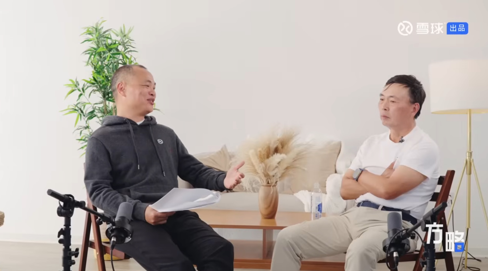

在听完 2 小时的雪球创始人方三文与传奇投资人段永平之间的对话后，蛮有感触。从中也悟出一些人生和处理哲理。这份报告并非对两人对话的简单记录或摘要，而是试图以此为切口，通过第一性原理的视角，深度解构段永平的核心哲学体系。这套体系并非源于复杂的金融模型，而是植根于一种近乎禅宗的极简主义逻辑：成功的本质不在于通过“加法”去捕捉无限的辉煌，而在于通过“减法”去规避致命的错误。我们将这一逻辑体系命名为“理性的减法”。其核心论点在于：个体可以系统性地降低犯错概率。这种对错误的极度厌恶与剔除，最终将在时间的长河中，以复利的形式转化为巨大的成功与一种罕见的“轻松”人生状态。

### 做对的事”与“把事情做对”的辨析

在管理学与投资学的经典语境中，彼得·德鲁克曾区分过“效能”（Effectiveness）与“效率”（Efficiency）。段永平将这一区分升华为一种生存哲学：“做对的事情”是关于方向的选择，涉及价值观与战略原点；“把事情做对”是关于过程的优化，涉及战术执行与技术细节。

在方三文与段永平的对话深处，隐藏着一个被大多数人忽视的逻辑层级：如果方向（做对的事）错误，那么执行（把事情做对）越高效，距离真理与价值的彼岸就越远。例如，一家公司如果致力于开发一款违背用户真实需求或伦理底线的产品（做错的事），即便其工程师团队拥有世界级的执行力（把事情做对），其最终结果也只能是更快速的毁灭。

“本分”是段永平哲学体系中的基石概念，也是理解所谓“做对的事”的唯一钥匙。在外界看来，“本分”常被误读为老实、保守或缺乏进取心。然而，经过深度剖析发现，“本分”实际上是一种极高维度的认知能力——即隔离噪音、回归事物本源的能力。“本分”不仅是一种道德自律，更是一种在这个充满欺骗性信号的市场中保持清醒的认知工具。它要求投资者在面对诱惑时，能够反求诸己：“这是否符合常识？这是否可持续？我是否真的理解？”这种对“原点”的执着，使得段永平能够避开诸如乐视网、各类概念币等虽喧嚣一时却最终归零的“机会”。

“做对的事”还包含了一层对商业模式道德属性的考量。在段永平看来，一个好的生意模式，必须是能够为消费者创造真实价值，并因此获得合理回报的闭环。任何试图通过欺诈、利用人性弱点或零和博弈来获取利润的行为，都被归类为“不对的事”。这种判断并非出于迂腐的道德说教，而是基于长期的功利主义计算。不道德的商业模式（如庞氏骗局、掠夺性借贷）虽然可能在短期内“把事情做对”从而获得暴利，但其系统内部积累的风险（法律风险、信誉风险）最终会爆发，导致总价值归零。因此，坚持“做对的事”，实际上是在消除企业经营中的“黑天鹅”风险，是实现复利增长的前提。

### 少做错事：不为清单（Stop Doing List）

关于“不为清单”，播客中反复提及了巴菲特著名的“25/5 法则”。这一法则的具体操作是：列出你人生中最重要的 25 个目标，圈出其中最重要的 5 个，然后将剩下的 20 个目标列入“不惜一切代价避免”的清单（Avoid-At-All-Cost List）。

段永平将这一逻辑运用到了极致。他的投资组合极度集中（苹果、伯克希尔、腾讯、茅台等少数几家），这并非因为他找不到其他好公司，而是因为他深刻理解，任何分散精力去关注第 6 个、第 10 个平庸机会的行为，都是对前 5 个卓越机会的背叛。在资源（资金、时间、心力）有限的前提下，拒绝平庸的“好”，是通往“伟大”的唯一路径。

“不为清单”在段永平的哲学中，更重要的功能是作为一道防火墙，隔绝那些可能导致毁灭性后果的行为。这与查理·芒格的教诲一脉相承。以下是段永平及其精神导师们反复强调的几条核心“不为”准则：

1. 不做空（No Shorting）： 做空的收益是有限的（最高 100%），但风险是无限的（股价可无限上涨）。这种不对称性违背了“做对的事”的基本数学逻辑。  
2. 不加杠杆（No Leverage）： 杠杆放大了波动，使得短期的市场非理性波动足以摧毁长期的理性布局。对于追求长久安稳的人来说，杠杆是引入归零风险的元凶。  
3. 不碰不懂的东西（No Circle of Competence Violation）： 踏出能力圈往往是亏损的开始。

通过“不为清单”剔除掉所有包含归零风险的行为（如杠杆、做空、欺诈），段永平实际上是将自己置于了一个非遍历性的安全区，确保了只要时间足够长，成功就是必然的。

现代心理学研究表明，人类的意志力是一种可耗尽的资源，这被称为“决策疲劳”（Decision Fatigue）。每一天，面对无数微小的选择，大脑都在消耗能量。“不为清单”不仅是风险控制工具，更是效率工具。当遇到一个带有杠杆的投资机会时，普通投资者可能需要耗费数小时去计算收益率、评估风险、纠结博弈。而对于段永平，因为“不加杠杆”在“不为清单”上，他的大脑可以瞬间输出“No”的指令，且不消耗任何认知能量。

这种对决策流程的简化，使得他能够将宝贵的脑力留给那些真正需要深度思考的复杂问题（如洞察 AI 对苹果商业模式的长期影响）。这就是他能够保持生活“轻松”、打高尔夫球的同时还能取得巨大投资回报的秘密之一。

### 及时止损：反人性的理性

“做对的事”有一个必然的推论，即“发现不对，必须及时停止”。段永平有句名言：“**发现错了马上停，就是最小的代价。**”。这句话听起来简单，但在实际操作中却极度反人性。

人类心理普遍存在“损失厌恶”（Loss Aversion）和“沉没成本谬误”（Sunk Cost Fallacy）。当我们在一项投资或一个项目中投入了大量金钱、时间与情感后，即便理智告诉我们前景黯淡，情感上我们也难以接受“承认失败”的痛苦。我们倾向于继续投入，试图“回本”或证明自己当初的选择是正确的。

段永平在这一点上展现出了近乎冷酷的理性。他在对话中多次提及，无论过去投入了多少，那都是历史成本，与未来的决策无关。未来的决策只应基于对未来的预期收益判断。如果未来的预期收益为负或低于机会成本，那么此刻停止就是收益最大化的选择。

这种决策需要的不仅仅是智慧，更是巨大的勇气。它要求决策者能够斩断“面子”、无视舆论压力，完全忠诚于商业的底层逻辑。段永平对此类决策的评价往往是：“**改正错误总是越早越好，不管多大的代价，都是最小的代价。**”

在投资领域，段永平也曾经历过止损。他曾投资美国餐饮公司 Fresh Choice，初期基于对其商业模式的看好。然而，随着深入了解，他发现该公司的竞争环境恶化，且管理层无法扭转颓势。尽管他已经投入了大量资金甚至参与了管理尝试，但当他确认“这生意不对”时，他选择了卖出离场，承受亏损。

这次失败被他视为宝贵的教训，强化了他“不投资 turnaround（困境反转）公司”的“不为清单”。他意识到，有些错误是无法通过努力（把事情做对）来修正的，唯一的解法是离开。这种坦然面对亏损的态度，正是他后来在网易、苹果等投资上取得巨大成功的心理基础——因为他不会被烂资产拖死，永远有子弹留给好机会。

### **避免愚蠢胜过追求卓越**

在心理学和决策科学中，有一个观点是：“避免愚蠢比追求卓越更容易”。追求卓越需要天赋、运气和极度的努力，往往可遇不可求。但避免愚蠢——如不要酗酒、不要犯罪、不要投资骗局——只需要常识和自律。段永平的智慧在于，他极其坦诚地承认自己的无知。对于不懂的生意，无论别人赚了多少钱，他都能心如止水。这种将复杂问题剔除出决策清单的能力，极大地提高了他在剩余决策中的胜率。

在对话中，方三文与段永平不可避免地谈到了当下最热的 AI 话题。段永平承认 AI 是工业革命级别的变革，将重塑由于医药研发、企业调研等多个行业。然而，他的反应并非焦虑地去追逐每一个 AI 概念股。

基于“做对的事”和“逆向思维”，他对 AI 的态度非常清晰：

1. **泡沫的必然性：** 任何技术革命初期都会伴随巨大的泡沫，追逐泡沫是赌博，不是投资（属于“不对的事”）。  
2. **价值的归属：** 最终的赢家是那些能利用 AI 加强护城河的公司，而不是仅仅炒作概念的公司。例如，苹果如果将 AI 整合进 iOS 生态，其用户粘性会更强，这是他继续持有苹果的逻辑。  
3. **能力圈的坚守：** 如果看不懂哪家 AI 初创公司能活下来，那就放入“太难”堆，不碰。

这种在技术巨变面前的定力，正是“本分”哲学的现代体现。他不在乎是否错过了英伟达的某一波涨幅，他在乎的是自己手中的资产是否依然坚实。

### **结论：轻松是正确的副产品**

综上所述，段永平在与方三文的对话中展现出的，不仅是一套投资方法论，更是一套关于如何在这个复杂世界中安身立命的生存哲学。这套哲学的终极指向是“轻松”。人们往往认为成功必须伴随着痛苦、焦虑和过度劳累。但段永平的生活状态——闲适、打球、做慈善、偶尔在雪球上发帖——向我们展示了另一种可能：人生可以是轻松的，只要你不再试图做那些注定会带来痛苦的蠢事。

这种“轻松”是严谨逻辑推演的结果：

* 因为有不为清单，所以没有了因为贪婪和诱惑带来的灾难性风险，也免除了在无数平庸机会中纠结的决策疲劳。  
* 因为坚持做对的事（本分），所以没有了谎言被戳穿的恐惧，建立起了极低的信任成本和极高的人际护城河。  
* 因为懂得及时止损，所以没有了被沉没成本拖入深渊的绝望，永远保持着重新开始的资本与活力。  
* 因为运用逆向思维，所以没有了追求完美的焦虑，只需要安稳地避开愚蠢，等待复利的花开。

听完访谈后，段永平的智慧告诉我们，人生和投资一样，不是一场关于谁跑得最快的短跑，而是一场关于谁活得最久、犯错最少的马拉松。在这个充满噪音的世界里，理性的减法，才是通往自由与富足的最短路径。

