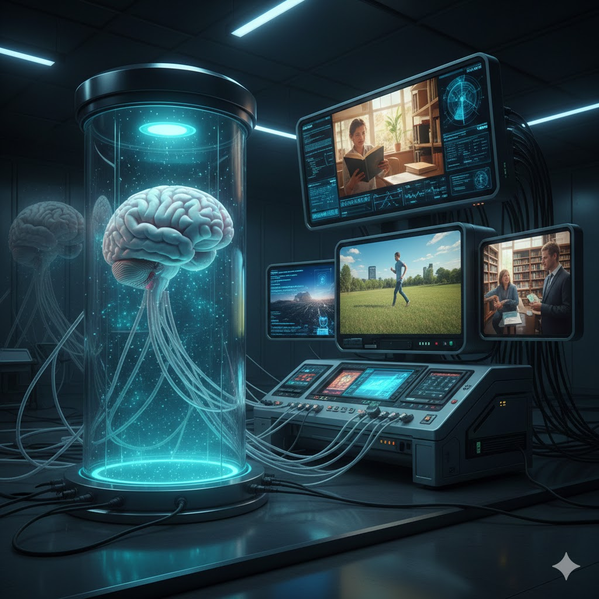

# **什么是缸中之脑 ？**

## **缸中之脑的定义**

缸中之脑（Brain in a Vat, BIV）是一个经典的思想实验：设想一个人的大脑被取出并置于盛满营养液的缸中，其神经末梢与一台超级计算机相连。计算机通过发送电信号，在大脑中模拟出与现实世界完全一致的感官体验。该实验的核心在于探讨：如果模拟体验在内部逻辑上是自洽且无法分辨的，我们如何证明自己并非处于这种虚幻的模拟之中？这一假说挑战了人类对真实世界和知识可靠性的根本认知。

### **缸中之脑的怀疑论逻辑结构**

缸中之脑是怀疑论最出名的例子，其逻辑推导过程非常直观：如果你认为自己正坐在书桌前，那么前提是你必须确定自己不是一个被关在实验室里的“缸中之脑”。然而，问题的核心在于，如果计算机模拟的电信号与真实感官体验完全一致，你根本无法从内部证明自己不是那个缸里的脑子。这种无法排除的可能性导致了确定性的崩塌：既然你无法否定自己处于模拟之中，那么你所认为的“坐在书桌前”这一事实也就失去了绝对的真实性。这种逻辑就像多米诺骨牌，一旦最基础的现实感被推倒，我们所有的知识体系都会随之动摇。

这种对真实的怀疑并非现代人的专利，而是随着人类认知的演进而不断变形。在古代，人们通过“庄周梦蝶”或幻象来探讨梦境与现实的模糊边界；到了近代，笛卡尔提出了“恶魔假设”，设想一个邪恶的神性生物在操纵我们的感知；而在科技发达的现代，这种担忧演变成了“缸中之脑”，将欺骗的源头指向了神经电信号的模拟。如今，随着算力的飞跃，人们甚至开始讨论“模拟假设”，怀疑整个宇宙是否都只是高等文明运行的一段程序。从超自然力量到数字运算，人类对“真实性”的挑战从未停止。

针对这种令人绝望的怀疑论，哲学家希拉里·普特南提出了一个非常巧妙的反驳。他认为，如果你真的是一个“缸中之脑”，你甚至根本无法真正表达出“我是一个缸中之脑”这个想法。

普特南的逻辑核心在于：一个词语的意思，取决于你平时接触到的真实事物。举个例子，如果你从小到大从未见过真正的树，只见过电脑模拟出来的树，那么当你开口说“树”这个词时，你指的其实是那段电脑程序，而不是现实中那种有树皮和叶子的植物。

按照这个思路，我们可以推导出一个有趣的结论：假设你真的是一个被关在缸里的脑子，那么你脑海里所认为的“缸”和“脑”，其实都只是计算机模拟出来的幻影。当你感叹“我是一个缸中之脑”时，你实际上是在说“我是一个模拟幻象里的模拟脑子”。但现实中的你，是一个真实物理世界里的肉质脑子，被关在一个真实的金属或玻璃缸里。所以，你嘴里说的那个“脑”和“缸”，跟现实中困住你的那个“脑”和“缸”根本不是一回事。

简而言之，普特南认为，“我是缸中之脑”这句话本身就是一个无法成立的悖论：如果你不是缸中之脑，这句话当然是假的；如果你真的是缸中之脑，由于你无法真正理解和指称现实中的“缸”和“脑”，你所表达的内容在逻辑上依然是假的。通过这种逻辑，普特南试图证明，我们既然能够思考和讨论现实，本身就说明我们并非完全与现实隔绝。

### **普特南反驳的局限性：如果怀疑依然成立？**

虽然普特南的反驳听起来很精妙，但很多学者认为它并不能完全消除我们的焦虑。他的逻辑主要针对的是那些“一出生就在缸里”的大脑，但在其他几种情况下，这种反驳就显得有些无力了。

首先是“半真半假”的情况。想象一下，如果连接大脑的计算机并不是凭空编造画面，而是连接着现实世界的摄像头和传感器，那么这个大脑看到的“树”虽然是电信号，但其源头依然是现实中真实的树。在这种情况下，大脑所说的“树”依然指向真实世界，普特南的逻辑就失效了。我们依然无法确定，自己是不是正通过一套复杂的机器系统在“间接”地观察世界。

其次是“半路入缸”的情况。如果一个人在现实世界生活了二十年，然后突然被绑架，大脑被放进了缸里。此时，他脑子里关于“缸”和“大脑”的概念是基于他过去二十年真实生活建立的。当他感叹“我是一个缸中之脑”时，他指的就是现实中那个装他的容器。在这种情况下，普特南那个“你没见过真缸所以指代不了真缸”的说法就完全站不住脚了。

因此，普特南虽然在逻辑上钻了一个聪明的空子，但并没有从根本上解决“我们如何证明现实是真实的”这一困境。

除了逻辑上的争论，科学家们还从生物学角度提出了质疑：大脑真的能脱离身体独立存在吗？在他们看来，大脑并不是一个可以随时拆卸的“插件”，它和身体是一套紧密协作的系统。大脑的运作依赖于血液中的激素、内脏的反馈以及肌肉的运动信号，如果没有了身体这个“硬件”的支持，大脑的意识状态可能会迅速崩溃，甚至根本无法产生人类水平的思维。而随着生物技术的发展，这种担忧正变得越来越真实。如今，科学家已经在实验室里培养出了微小的“脑类器官”。虽然这些组织目前还非常初级，但伦理学家已经开始担忧：如果这些实验室里的“小脑”真的产生了某种原始的感知，却因为没有感官和肢体而被永远禁锢在培养皿里，这是否意味着我们正在制造一种极其残忍的、现实版的“缸中之脑”？这让原本虚幻的思想实验，变成了一个严肃且紧迫的医学伦理难题。

## **缸中之脑与脑机接口的医疗伦理**

缸中之脑的逻辑在现代医学中有着最直接的映射：脑机接口（BCI）。对于患有“完全闭锁综合征”的患者，他们的大脑在生理上依然活跃，却无法控制身体，这使他们成为了现实中“身体里的缸中之脑”。

### **恢复沟通的代理权**

对于这些患者，BCI 技术不仅是医疗工具，更是他们重返社会的唯一通道。通过解码神经信号，BCI 让被禁锢的大脑重新获得表达能力，使个体能够再次行使作为“人”的自主权。

### **技术失效的伦理风险**

这种“部分入缸”的状态也带来了新的伦理挑战。如果相关技术公司停止支持或设备发生故障，患者面临的不仅是工具损坏，而是再次与世界彻底隔绝的“存在性坍塌”。这种伤害远超生理层面，因为它切断了大脑与现实世界唯一的生存纽带。

## **思想实验的横向对比：价值、真实性与概率**

为了全面理解缸中之脑，有必要将其与其他著名的模拟/幻觉类思想实验进行系统对比。

### **缸中之脑 vs. 诺齐克的经验机器**

罗伯特·诺齐克（Robert Nozick）提出的“经验机器”旨在反驳快乐主义（Hedonism） 30。

* **区别点：** BIV 是一个关于**知识**的实验（我们能否知道现实？），而经验机器是一个关于**愿望**的实验（如果可以，你愿不愿意活在完美的模拟中？） 30。  
* **洞见：** 诺齐克发现大多数人会拒绝进入机器，这证明了人类价值不仅在于内部感受，还在于“真实地做某事”以及“成为某种特定的人” 31。

### **缸中之脑 vs. 庄周梦蝶**

庄子的寓言是中国哲学对实在性问题的最早探讨 12。

* **共同点：** 两者都质疑了清醒状态与梦幻状态的界限 12。  
* **区别点：** 庄子更多地表现出一种视角主义（Perspectivism），强调万物齐一和转化的必然性，而 BIV 则植根于现代科学的物理还原论，带有一种强烈的、对“操纵”与“欺骗”的焦虑感 32。

### **缸中之脑 vs. 波斯特罗姆的模拟假设**

尼克·波斯特罗姆（Nick Bostrom）的模拟假设是 BIV 在当代计算科学背景下的逻辑延伸 14。

* **范式转移：** BIV 依然假设了一个物理大脑的存在（生物基础），而模拟假设则设想我们可能纯粹是某种“祖先模拟”程序中的一段代码（纯数字基础） 15。  
* **概率论证：** 模拟假设不再依赖于怀疑论的逻辑，而是基于统计学：如果未来文明可以运行数千个模拟，那么我们位于“原始现实”中的概率仅为几千分之一 14。

## **流行文化中的哲学映像**

缸中之脑场景之所以具有如此持久的生命力，部分源于其在文学和影视作品中被赋予了丰富的情感色彩和叙事深度。

### **影视叙事中的 BIV**

1. **《黑客帝国》（1999）：** 该系列不仅是普特南思想的视觉化，更引入了“红色药丸”的伦理选择——痛苦的真相是否优于虚假的安逸 4？  
2. **《第十三层》（1999）：** 电影探讨了多重嵌套模拟。当主角意识到自己生活在 1937 年的模拟中，而模拟他的人又在 2024 年被模拟时，这种“无限递归”引发了对“基础现实”是否存在的深刻绝望 16。  
3. **《星际迷航》（Star Trek）：** 多个分集（如“Spock's Brain”, “Ship in a Bottle”）探讨了大脑与身体分离、程序产生自我意识等主题，将 BIV 放入了广阔的星际伦理框架中 2。

### **文学中的先驱与扩展**

* **斯坦尼斯瓦夫·莱姆（Stanisław Lem）：** 在 1964 年的《技术大全》（Summa Technologiae）中，莱姆创造了“幻象学”（Phantomology）一词，描述了一种通过操纵输入信号制造虚假现实的技术，并预言了人类可能由此陷入的认知陷阱 37。  
* **格雷格·伊根（Greg Egan）：** 在《置换城市》（Permutation City）中，伊根探讨了意识作为一种纯粹数学模式的独立性，以及在计算资源受限的情况下，模拟意识如何争取生存权利的政治冲突 39。  
* **丹尼尔·丹内特（Daniel Dennett）：** 他的短篇作品《我在哪里？》（Where Am I?）以一种幽默的方式探讨了当大脑、感官和身体在空间上分离时，个人身份的中心点究竟在哪里 2。

## **知识论视角的总结与未来展望**

缸中之脑思想实验虽然最初是为了支持或反驳怀疑主义而设计的，但其影响已经渗透到了科学哲学的各个层面。它揭示了人类认知系统的一个根本矛盾：我们对外部世界的全部了解都必须经过感官信号的中介，这意味着在“体验”与“实体”之间永远存在着一条无法跨越的鸿沟 5。

### **从怀疑论到可靠论（Reliabilism）的转向**

面对 BIV 的挑战，现代知识论的一大转向是寻求非内省的辩护。可靠论者（Reliabilists）认为，只要我们的感官系统在正常环境下是“可靠的”并产生真信念，即使我们无法证明自己不是缸中之脑，我们依然拥有知识 42。我们不需要排除所有的怀疑论可能性，而只需要在“相关的可能世界”中达成认知的准确性 42。

### **物理主义的终局测试**

对于心智哲学而言，BIV 是物理主义的终极测试。如果 BIV 在逻辑和物理上是完全可能的，那么意识就真的可以被视为一种“软件”，其承载物（生物大脑还是硅基芯片）就变得无关紧要（即“底座独立性”，Substrate-independence） 14。这不仅为强人工智能（AGI）提供了理论基础，也为未来的“意识上传”描绘了迷人而又令人不安的蓝图 41。

### **结语**

缸中之脑不再仅仅是一个关于实验室里漂浮器官的古怪念头。在虚拟现实、脑机接口和人工智能日益普及的今天，它已演变成关于“人类本质”的深刻追问。我们是通过身体与现实相连，还是通过某种数字协议与信息相连？在追求真理的过程中，我们是否必须牺牲那种受到生物性保护的、熟悉的宁静？  
这一思想实验的真正价值，或许并不在于给出一个关于外部世界是否存在的终极证明，而在于它持续地迫使我们走出认知的舒适区，去检视那些支撑我们日常生活的、最基本却又最脆弱的信念。无论我们是否生活在缸中，对真实的渴望与对虚假的警惕，始终是人类精神中最坚韧的部分。
