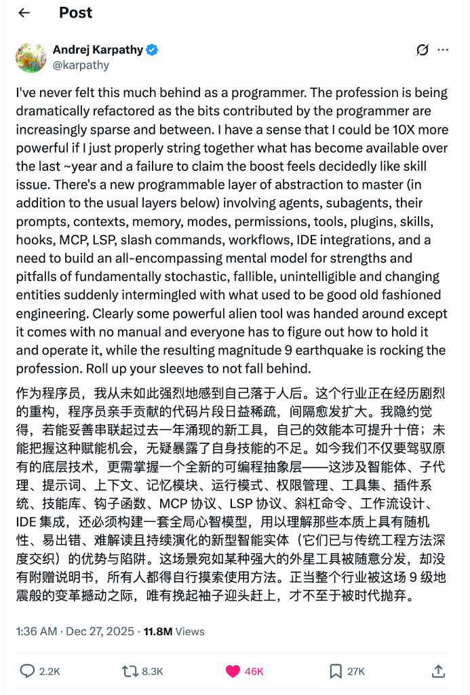

### 引言：来自顶峰的“震感”

今天早上，我在浏览技术圈动态时，看到了 Andrej Karpathy（前 Tesla AI 总监、OpenAI 创始成员）发的一条推文。读完之后，我坐在电脑前，久久不能平静。

在此之前，如果你问我“AI 时代程序员会不会失业”，我可能会给出一些模棱两可的安慰。但看到 Karpathy——这位站在全球 AI 金字塔尖的男人——都在感叹自己“从未如此强烈地感到落后（I've never felt this much behind）”时，一种巨大的、真实的下坠感击中了我。

他在推文中写道：

“这个行业正在经历剧烈的重构……我隐约觉得，若能妥善串联起过去一年涌现的新工具，自己的效能本可提升十倍；未能把握这种赋能机会，无疑暴露了自身技能的不足。”

如果是普通人说这话，我会觉得他在制造焦虑。但他是 Karpathy。当他说这像是一场“9级地震”时，如果你还感觉脚下的土地是稳固的，那你可能已经处于危险之中了。

### 一、 世界从未许诺过“安稳”

这种焦虑感让我陷入了深思。为什么我们会感到恐慌？

本质上，是因为我们潜意识里假设“世界应该是线性的、安稳的”。我们习惯了用过去十年的经验去推导未来十年的生活：学好 Java，掌握 Spring Cloud，做个架构师，然后安稳退休。

但现实狠狠地给了我们要给耳光。

回顾人类历史，我们就会发现，“安稳”从来都是短暂的幻觉，“动荡”和“变化”才是世界的底色。

我们的祖先并不是因为身体最强壮而活下来的。在冰河世纪来临时，那些固守原有狩猎方式、无法适应严寒和猎物变化的古人类，都灭绝了。活下来的，是那些学会了用火、学会了缝制兽皮、学会了随着气候迁徙的一小撮人。

正如达尔文所言：

“最终生存下来的，不是最强壮的物种，也不是最聪明的物种，而是最能适应变化的物种。”

我们将这种生物学的智慧投射到今天的数字世界，道理是完全一样的。AI 时代的这场“9级地震”，就是新一时代的“冰河世纪”。

### 二、 放弃“砌砖”，去学习如何“指挥”

Karpathy 在推文中提到了一个非常关键的概念：“全新的可编程抽象层”。

“如今我们不仅要驾驭原有的底层技术，更需掌握一个全新的可编程抽象层——这涉及智能体（Agents）、提示词（Prompts）、上下文（Contexts）、记忆模块（Memory）……以及构建一套全心智模型。”

这就是环境变化的具体表现。

过去，我们是“数字世界的砌砖工”。我们引以为傲的技能是能够熟练地搬运代码块、记忆复杂的语法、解决各种细微的 NullPointer 异常。我们靠“体力”和“熟练度”换取生存资源。

现在，环境变了。AI 已经能够以我们 10 倍、100 倍的速度去“砌砖”。如果我们还固执地认为“手写每一行代码”才是工匠精神，那我们就像是坚持用石斧砍树的原始人，而旁边的人已经开着伐木机进场了。

在这个新环境下，生存策略必须从“执行者”转变为“指挥官”。

**旧的生存技能：** 记忆 API、默写算法、拼写手速。

**新的生存技能：** 定义问题、设计工作流（Workflows）、编排智能体（Orchestration）、理解 AI 的能力边界与陷阱。

这就像 Karpathy 说的，这是一套“没有说明书的外星工具”。没有人会教你具体怎么做，因为规则每天都在变。但这正是机会所在——谁先摸索出这套外星工具的用法，谁就能在这个新世界里获得降维打击的能力。

### 三、 拥抱“非舒适区”：这是刻在基因里的本能

很多人面对这种剧变，第一反应是排斥，是抱怨：“为什么技术更新这么快？我学不动了。”

这很正常，这是生物趋利避害的本能。但在现代社会，这种本能会害了你。

我最近在尝试 Vibe Coding，试图用 AI 重构我的开发流程，从 Cursor 到 Google Antigravity，不断切换 。坦白说，这个过程并不舒服。我经常会遇到 AI 产生的幻觉代码，经常为了调试一个 Prompt 花费半小时。有时候我甚至想：“有这功夫，我自己早写完了。”

但每当这个时候，我就告诉自己：这是进化的阵痛。

如果我现在退回到舒适区，用我熟悉的 Java 老一套去解决问题，我确实能获得当下的安宁。但这就相当于在气候变冷时，依然选择赤身裸体，拒绝穿上那件虽然笨重但能保命的兽皮。

我们人类本身就是适应机器。

当我们还是婴儿时，我们适应了直立行走，尽管摔了无数次跤。

当我们进入工业时代时，农民适应了流水线，尽管那完全违背了日出而作的习惯。

现在，我们需要适应与“硅基智能”共生。

### 四、 唯一的出路：卷起袖子（Roll up your sleeves）

文章的最后，我想引用 Karpathy 的结尾：

"Roll up your sleeves to not fall behind."（唯有挽起袖子迎头赶上，才不至于被时代抛弃。）

面对这场地震，我们不需要无谓的焦虑，也不需要廉价的乐观。我们需要的是行动。

既然这个世界没有给我们提供“安稳”的环境，那我们就不要去奢求它。既然“外星工具”没有说明书，那我们就自己去写这份说明书。

对于像我这样 35+ 的程序员来说，这反而是最好的时代。因为“新的一层抽象”需要的不仅仅是编码能力，更需要对系统的理解、对业务的洞察、以及逻辑思维能力——这些是我们多年积累下来的宝贵财富。只要我们愿意接上 AI 这个“外挂”，我们就能焕发出前所未有的生命力。

总结一下我的生存策略：

**承认差距，保持谦卑：** 连世界顶级的专家都觉得自己落后，我们更没有理由傲慢。承认自己不懂，是学习的第一步。

**极速适应，小步快跑：** 不要等技术成熟了再学。现在就去用，去试错，去用 AI 写一个小插件，去用 AI 翻译一段播客，去建立自己的工作流。

**构建新的心智模型：** 停止把自己定义为“写代码的人”，开始把自己定义为“解决问题的人，且善用 AI 工具”。

风浪越大，鱼越贵。在这个剧烈变化的时代，只有最敏锐的冲浪者，才能立于潮头。

与君共勉。
