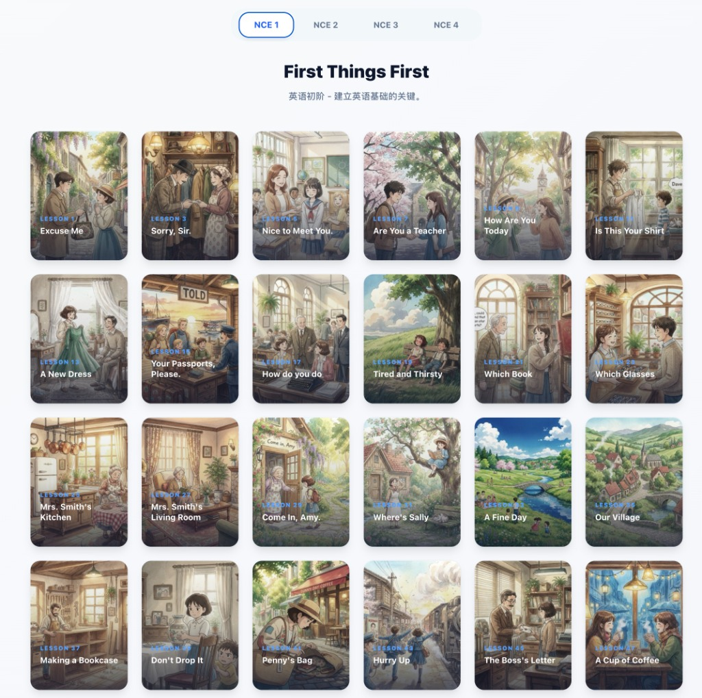
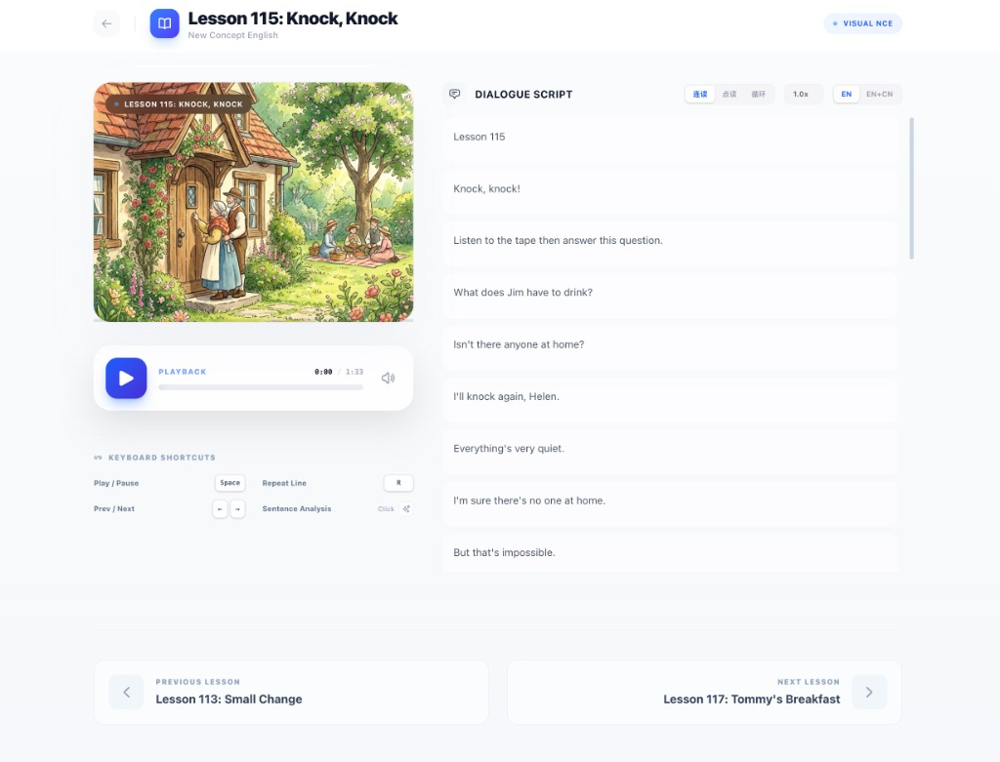
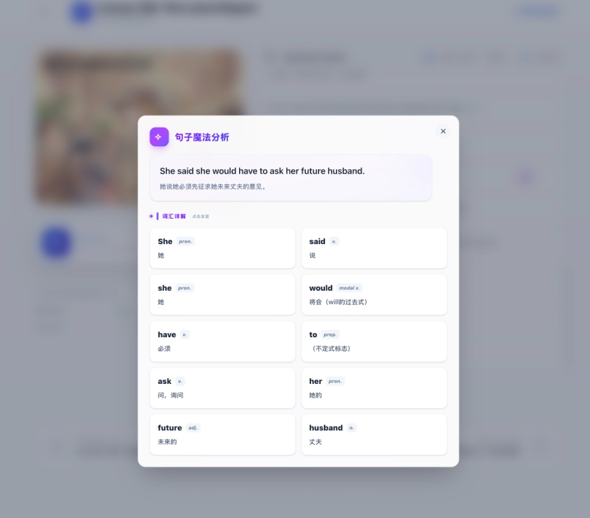

最近我做了一个小小的实验：利用 **AI 绘图**能力，结合最新的 **Vibe Coding** 开发模式，把经典的《新概念英语》重新“装修”了一遍，做成了一个完全免费的英语学习网站——**Visual NCE**。

没有复杂的套路，初衷很简单：我希望英语学习不再是枯燥的“背课文”，而是像看漫画一样有趣、自然。

### 01. 经典教材的“视觉化”重生

《新概念英语》是一套非常优秀的教材，但对于今天的学习者来说，纯文字的排版在某种程度上确实容易让人产生畏难情绪——也就是大家常说的“打开书就想困”。

于是我想，为什么不利用现在的 AI 能力，给每一篇课文都配上一张图呢？

我选择了吉卜力（Ghibli）的画风，为每一课都生成了专属的题图。当你打开网站时，不再是密密麻麻的单词表，而是一张张由 AI 绘制的故事场景。

这种**一课一景**的设计，目的是为了营造一种“沉浸感”。我们对图像的记忆远比对文字的记忆深刻。当你看到画面时，脑海中浮现的是场景，而不是枯燥的中文翻译。

### 02. 技术赋能：Vibe Coding 带来的可能性

作为一个程序员，我最近也在实践 Andrej Karpathy 提到的 **Vibe Coding**（氛围编码）。简单来说，就是利用 AI 辅助编程，快速将脑海中的创意落地。

以前开发这样一个网站可能需要数周，但借助 AI，我能将更多的精力集中在“从用户的角度打磨产品”上，而不是死磕代码细节。

在学习界面，我去掉了所有多余的干扰元素。这里没有广告，没有付费解锁，只有纯粹的内容。

你可以一边听着原版音频，一边看着插图，像看连载漫画一样刷完一课又一课。这种“无压力”的学习状态，才最容易坚持下来。

### 03. 始于颜值，忠于内容

当然，光有好看的皮囊是不够的。为了让它真正具有学习价值，我对每一句课文都进行了深度处理。

*   **句法分析**：点击任意句子，都有详细的语法结构拆解。
*   **词汇详解**：哪里不会点哪里，单词的词性、含义一目了然。

我希望 Visual NCE 能成为一个安静、纯粹的角落，供那些想学好英语、又苦于找不到合适工具的朋友们使用。

### 🌏 欢迎体验

这个项目目前是完全**免费**的，未来也会保持免费。

� **体验地址：[https://nce.xiao27.com](https://nce.xiao27.com)**

如果你觉得它对你有帮助，欢迎收藏并在电脑端打开体验（为了更好的视觉效果，强烈建议使用大屏浏览）。也欢迎把它推荐给身边需要的朋友，我们一起在 AI 的帮助下，快乐学习。
