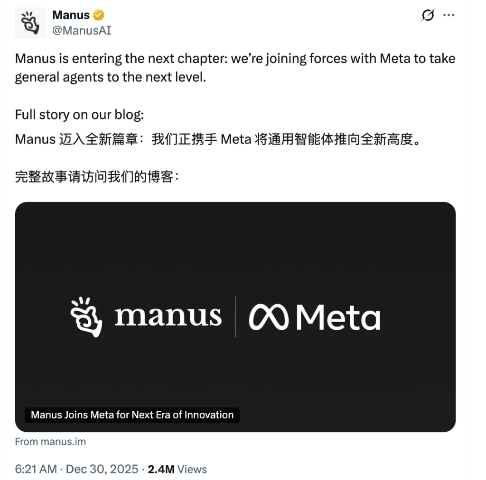

今天早上一条新闻刷屏了技术圈：**Meta 正式收购了 Manus**。

Manus 在推文中写道：“Manus 迈入全新篇章：我们正携手 Meta 将通用智能体推向全新高度。”

这件事之所以让我感触颇深，不仅是因为它是一桩巨额收购案，更因为它是一个极具象征意义的信号：**在 AI 浪潮中，应用层的机会，或许远比我们想象的要大。**

### 一、 Manus 的前世今生：困境与突围

Manus 的创业，并非一帆风顺的爽文。从 2022 年以浏览器插件起步（Butterfly Effect Technology），到 2025 年的惊艳亮相，他们经历的每一步都充满了挑战。

**1. 逆风搬迁，向死而生**

2025 年 7 月，Manus 做出因为种种原因，无奈做了一个艰难的决定：将全球总部从中国迁往新加坡。

当时，外界的猜测与争议甚嚣尘上。有人质疑他们是为了规避美国芯片禁令，有人猜测是为了逃避由于早期“极度封装（Extreme Repackaging）”带来的原创性指责，也有人认为这是为了更方便接触国际资本。

这是一个巨大的赌注。离开熟悉的土壤，裁减此前的核心团队，在异国他乡重建一切，这种阵痛足以击垮大多数初创公司。

**2. 在噪音中保持专注**

更糟糕的是，Manus 一直处于巨大的舆论风暴眼。

*   **“套壳”争议**：早期被指责仅仅是 Claude 和 Qwen 的“缝合怪”。
*   **性能质疑**：GAIA 测试成绩被质疑造假，Demo 视频被指过度营销。
*   **甚至关停风波**：曾因被恶意利用和加密货币骗局关联，导致社交账号被封禁。

面对铺天盖地的负面声音，Manus 团队做了一件最难的事：**闭上嘴，做产品。**

他们没有陷入无休止的口水战，而是默默优化 Agent 的执行逻辑，打磨用户交互，直到今天被 Meta 认可。这种**屏蔽噪音、死磕产品**的定力，或许才是他们能走到今天的核心原因。

### 二、 Cursor 与 Manus：应用层的“自顶向下”胜利

过去两年，关于 AI 创业有一个巨大的争议：是做基座大模型（Foundation Model），还是做应用（Application）？

Manus 的成功狠狠地打破了“没有模型就没有护城河”的偏见。**这一点在 Cursor 身上也得到了完美的印证。**

Manus 和 Cursor 有着惊人的相似路径：他们最初都没有自研的大模型，都是从应用层切入，采取了一种**自顶向下（Top-Down）**的策略。

Cursor 没有去卷底层的代码补全模型，而是专注于 IDE 的交互体验（Developer Experience），专注于让 AI 真正融入开发流。Manus 同样如此，它把 AI 的能力封装在一个极佳的 Agent 交互体验中，解决了一个个具体而微的真实问题。

这告诉我们：**在这个时代，卓越的工程能力（Engineering）本身就是一种稀缺的护城河。** 那些能把模型能力“吃透”，并用极致的工程手段转化为用户价值的团队，依然拥有巨大的机会。

### 三、 告别 "Copy to China"

回望过去的移动互联网时代，我们的创业路径往往有着明显的“时间差”——所谓的 "Copy to China"。硅谷出了什么新模式，我们拿过来，做本土化。

但 AI 把这张桌子掀了。

大模型把所有人拉回了同一起跑线。无论是硅谷的精英，还是国内的开发者，大家面对的是同一个 API，同一个技术边界。

在这个新的赛场上，不再有现成的作业可以抄。谁能赢，不取决于谁抄得快，而取决于谁对场景理解得深，谁的执行力更强。

### 四、 天时、地利、人和的新定义

Manus 的案例，给当代怀揣梦想的年轻人打了一剂强心针。

*   **天时（AI 时代）**：技术变革带来了生产力的重新分配。
*   **地利（面向国际）**：像 Manus 一样，从第一天起就做 Global Native（生而全球化）的产品。
*   **人和（定力与执行）**：能够像 Manus 团队一样，能够在巨大的不确定性和舆论噪音中，守住初心，拥有强悍的执行力。

### 五、 程序员命运的改写：从“螺丝钉”到“独立造物主”

最后，作为一个技术人，我想谈谈这对我个人的触动。我认为，随着 AI 编程能力的指数级提升，**程序员这一群体的命运正在被彻底改写。**

在古典软件工程时代，我们是庞大工业机器中的一颗**螺丝钉**。分工极度细化，前端不懂后端，后端不懂运维。在大规模工业化生产下，个人的力量微乎其微，你没办法独自完成一个稍微复杂的项目。

但 AI 把这个限制打破了。

现在的 AI，让**一个人就是一支队伍（One-man Army）**成为可能。它正在消灭那些只需重复劳动的“普通程序员”岗位，但同时也为那些**有想法、有创造力**的程序员炸开了职业天花板。

以前你的能力边界取决于你敲代码的速度和记忆 API 的能力，现在取决于你**想象力的广度**和**对需求的洞察**。

**在 AI 极度赋能的今天，限制开发者的不再是繁琐的工具链和复杂的环境配置，而是你脑海中那一闪而过的想法，以及将想法落地的执行力。**

### 写在最后

Meta 收购 Manus，是应用层的胜利，也是新一代创业者的胜利。

它证明了：**你不必成为巨人，依然可以站在巨人的肩膀上摘星星。**

对于当下的开发者而言，与其焦虑于被 AI 替代，不如利用好这个工具，去成为那个“独立造物主”。因为在 AI 时代，敏锐的感知力、卓越的工程力，以及在困境中坚持的定力，才是通往不凡事业的门票。
