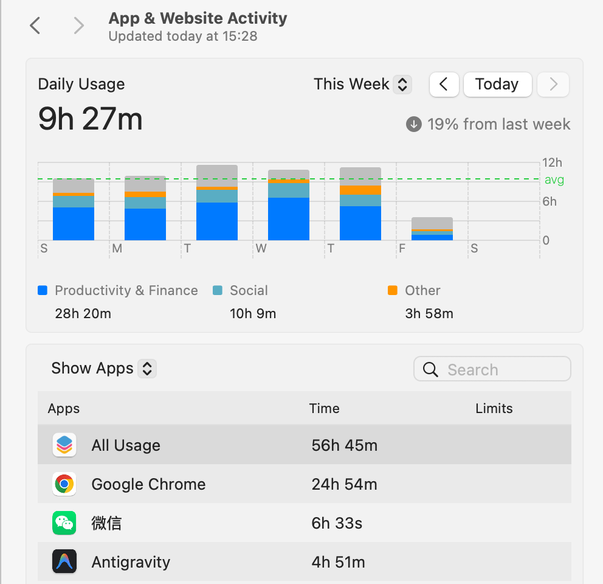
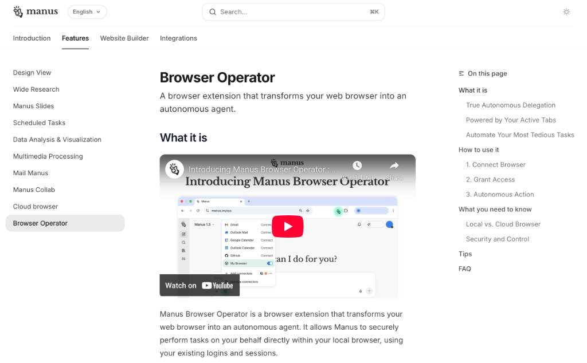
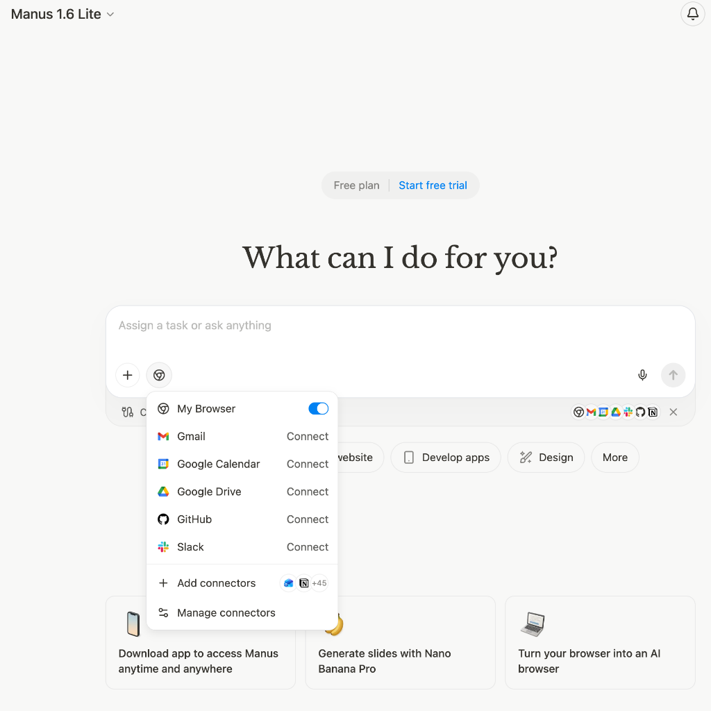
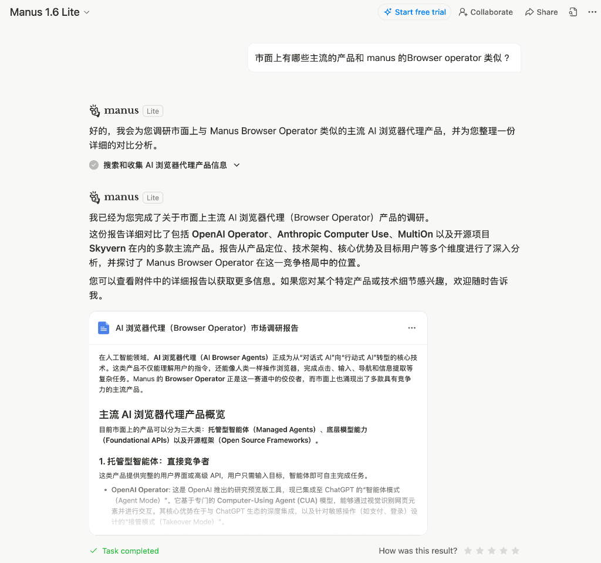

作为一个一直在第一线写代码的工程师，最近几个月，我一直在折腾一件事：我一直在用 AI 工具自动化和重构我的数字世界的工作流。截止到目前，Antigravity 已经完全自动化我的编码工作，对于写代码，每天开着 Agent Managet，可以让 Agent 并行的处理多个项目的编码工作；在对于文件系统和 Obsidian 的操作，我也习惯了跟 Claude Code 或者 Gemini 直接对话。可当我翻开电脑的统计报告时，那个数字还是把我吓了一跳：**我每周竟然要在浏览器里待上 20 多个小时。** 

在这 20 个多小时里，我大部分时间都在做一些毫无技术含量的操作：疯狂点鼠标、机械地滚轮翻页、在不同窗口间来回复制粘贴。这块地盘，简直成了我数字化工作流里最后一片没被智能化的“荒地”。虽然我也试过各种 AI 插件，但要么是反应太慢，要么是用起来总觉得隔了一层，始终没法像长了手一样顺手。我就在想办法，怎么把这块的活给自动化了，直到我找到了 **Manus Browser Operator** ：

其实 Manus 并非新物种，甚至在我早期的关注列表中，它曾因为邀请码机制和“非开发者导向”的标签而被我搁置。我认为那是给普通用户准备的玩具，而非程序员的利器。但当“浏览器”成为我工作流中最大的瓶颈时，我决定放下偏见，重新审视这款工具。我安装了 Manus 的 Browser Operator 插件，第一次尝试将“控制权”真正移交。（用户体验非常好，安装一个插件，然后打开 Manus 就能用上了），如下：

只需要把 My Browser 打开，然后告诉它需要做什么，就能看到 Manus Browser Operator 开始打开一个标签页独自的开始干活了，其实一开始没抱太大期待，以为和 ChatGPT AI 浏览器那样无聊的的东西，说实话，最让我觉得“真香”的瞬间，是当我把它丢到那堆乱七八糟的 **ELK 日志分析**里时。以前查日志这事儿，程序员都懂，简直像是在大海里人工捞针。你得不停地挖数据、对时间戳、对报错信息，这活儿一点技术含量都没有，纯粹在磨人的耐心。这次我直接给 Manus 下了个特简单的“人话”指令：

> “帮我翻翻最近一小时的日志，看看那几个报错（E、L、K）到底啥规律，最好给我整份明白的报告。”

这款产品的用户体验也做得非常好。Manus 给浏览器装上了“手”和“眼”，它自己去点链接、翻页、抓数据。它不是死板地跑脚本，而是真的像个懂行的助理，一边看一遍想。最后它给我的不是一堆原始字符，而是已经帮我分析好了的结果页。然后我让它做一些产品的对比分析报告也很好用，它不像其他大模型直接告诉你答案（大概率会有幻觉），而是会去打开浏览器去阅读相关网站后然后总结报告（真的有点智能体的味道了）。参考：

这一通操作下来，最直接的感受就是效率提升了不少。Manus 帮我处理了工作流中那些琐碎的浏览器操作，让我不再需要把大量精力耗费在机械的点击和跳转上。相比于之前的人工操作，这种自动化的方式确实节省了许多时间，让我能把更多心思放在核心任务和需要思考的任务上。如果你也经常需要在浏览器中处理重复性工作，Manus 的 Browser Operator 或许是一个值得尝试的效率工具。

---

**点这里试试：**

如果想跟我一样体验一下这种“浏览器自动驾驶”的感觉，可以用我的邀请码注册。听说用了码能额外拿 **500 积分**，上手体验试试吧。

🔗 **传送门**：[https://manus.im/invitation/RQEUNPFRRMVI](https://manus.im/invitation/RQEUNPFRRMVI)
