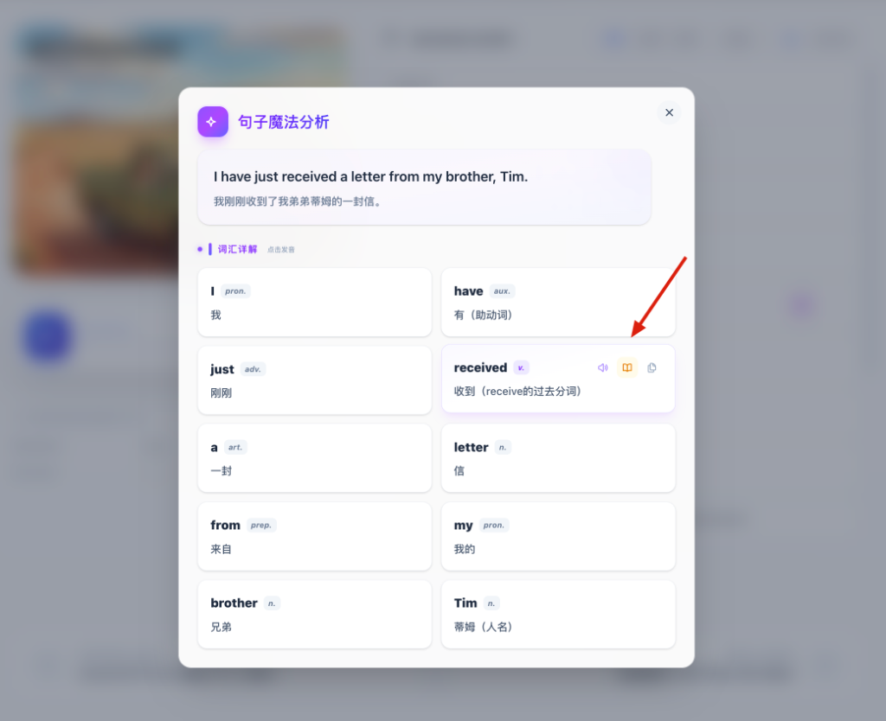
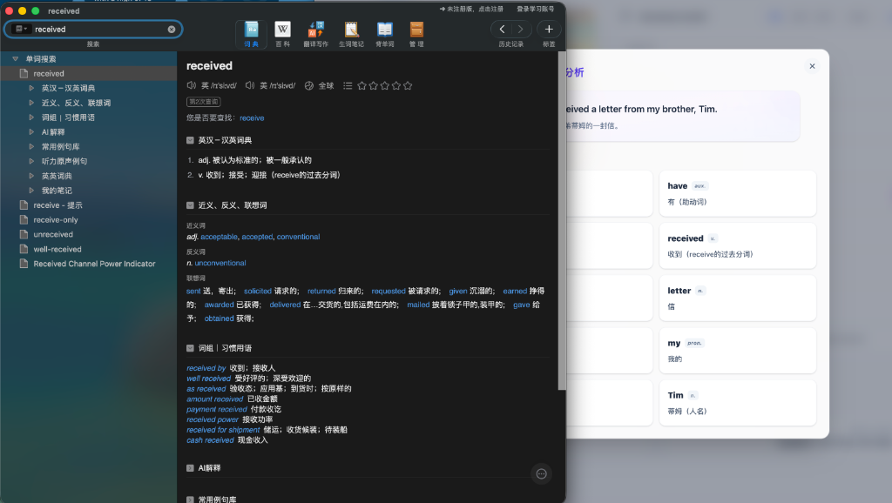

大家好，前段时间我跟大家分享了 **Visual NCE** 这个项目——那个利用 AI 和 Vibe Coding，给《新概念英语》换上一身“吉卜力”外衣的实验。没想到收到了很多朋友的关注和鼓励，大家对这种“沉浸式”的学习方式非常认可。

但在和大家的交流中，我也发现了一个被我忽视掉的“痛点”。

很多朋友在用 Visual NCE 学习时，虽然觉得画面美、音频纯，但一旦遇到生词，现有的流程还是显得有些“笨拙”。即便我们已经有了**逐句深度解析**和**词汇详解**，但总有那么几个词，你想去更专业的词典库（比如欧路词典）里看看它的例句、变体或者是笔记。

这时候，你只能：选中单词 -> 复制 -> 切换窗口 -> 打开词典 -> 粘贴 -> 回车。

这一套连招下来，虽然只需几秒钟，但它对**“心流”**的破坏是毁灭性的。你的大脑刚在浸润在精美的课文插图和正宗的英伦腔里，突然就被强制拉回到了机械的“复制粘贴”劳作中。

为了解决这个问题，我给 Visual NCE 加了一个“小零件”。

### 01. 词典一键直达：消灭“复制粘贴”

在最新的迭代中，我在单词分析卡片里增加了一个**词典直达按钮**。

现在的逻辑非常简单：当你在学习过程中，点击任何一个句子进行深度分析时，如果发现某个单词需要进一步查验，直接点击那个橘色的小图标（欧路词典的 Logo）。

它会直接唤起你电脑本地安装的**欧路词典 (Eudict)**，并自动搜索该单词。

没有跳转等待，没有复制环节，更没有繁琐的窗口切换动作。从你发现生词，到词典结果呈现在你面前，几乎是瞬时的。

这种**“一键直达”**的设计，背后其实是我对学习效率的一种执念：**最好的工具，应该是感觉不到它存在的。** 当你想查单词时，词典就该在那儿，而不是需要你去“请”它出来。

这种无缝衔接的体验，让你在查完单词后，能瞬间回到学习状态。你的专注力依然停留在课文的语境中，心流得以完美保留。

### 02. NCE 3 全量漫画更新：视觉盛宴的延续

除了功能的升级，内容层面也有了重大进展。

很多在学《新概念英语》第三册的朋友一直在催更。毕竟第三册的文章更长，逻辑更复杂，对视觉辅助的需求也更高。

今天，我很高兴地告诉大家：**NCE 3 的全部 60 课漫画插图，已经全部更新完毕！**

这意味着，从 Lesson 1 的 "A Puma at Large" 到最后一课，每一章都配上了高质量的、充满故事感的吉卜力风格插图。这些图不仅仅是为了好看，它们是根据课文情节精心设计的，能够帮你快速构建起在该语境下的视觉模型。

当你在看《Thirteen Equals One》时，AI 绘制的那个阴森古怪的钟表店和神情诡异的店主，能让你瞬间代入那个悬疑的氛围。

这种“视觉浸润”加上“一键词典”的组合，让 NCE 3 繁重的学习任务变成了一种像在看连载漫画、在玩 RPG 游戏一样的体验。

### 03. 产品还在完善，欢迎你来投喂建议

Visual NCE 的演进速度之所以能这么快，完全得益于 AI 赋能下的 **Vibe Coding**。我可以花更少的时间去纠结 CSS 布局，而把更多的时间花在监听用户反馈和实现有趣的逻辑上。

但作为一个独立项目，它显然还不完美。比如：
* 词典直达目前最完美的支持是欧路词典（Mac 端），其他词典的兼容性还在调试中。
* 移动端的交互体验距离“极致”还有一段距离。
* 还有很多辅助学习的功能（比如在线生词本、复习系统）还在脑海里打转。

所以我非常希望听到你的声音。

大家在使用过程中，觉得哪里好用，哪里用着别扭，或者还想要什么功能，请千万不要客气，**多多提意见，多多反馈。** 你的每一个建议，都可能成为下一个版本的主打功能。

### 🌍 结语

在 AI 时代，学习不应该再是一场苦旅。我们完全可以利用工具，把那些枯燥、重复、耗神的环节给抹平，让我们可以全身心地投入到知识本身。

Visual NCE 就是我在这条路上的一个小小尝试。

如果你还在为查单词时的频繁切换感到烦恼，如果你想体验不一样的可视化 NCE 学习，欢迎来试试新功能。

 **体验地址：[https://nce.xiao27.com](https://nce.xiao27.com)**

如果你觉得好用，也欢迎把它分享给身边的同学或朋友。我们一起在优美的画面和高效的工具中，找回学习英语的乐趣。

---
*注：为了获得最佳的词典唤起功能，强烈建议在电脑端（PC/Mac）使用 Chrome 或 Edge 浏览器进行体验。*
