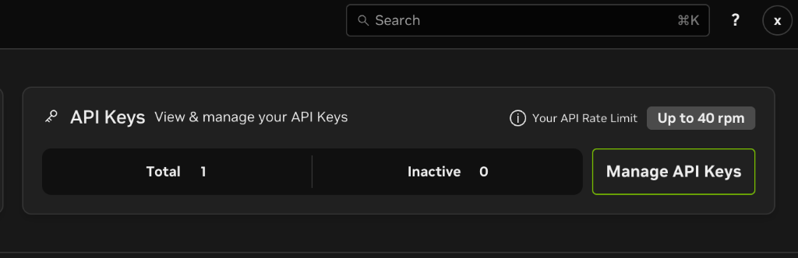
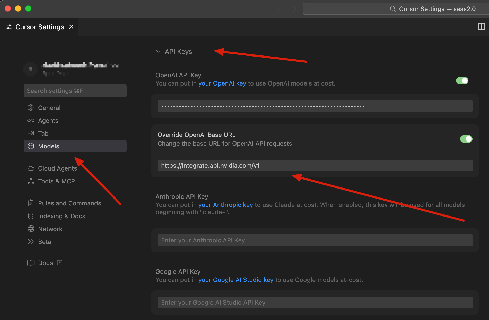
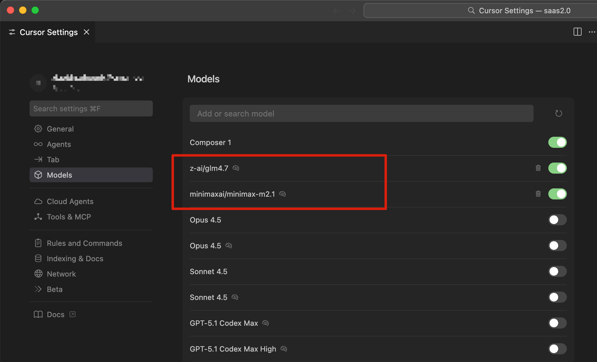
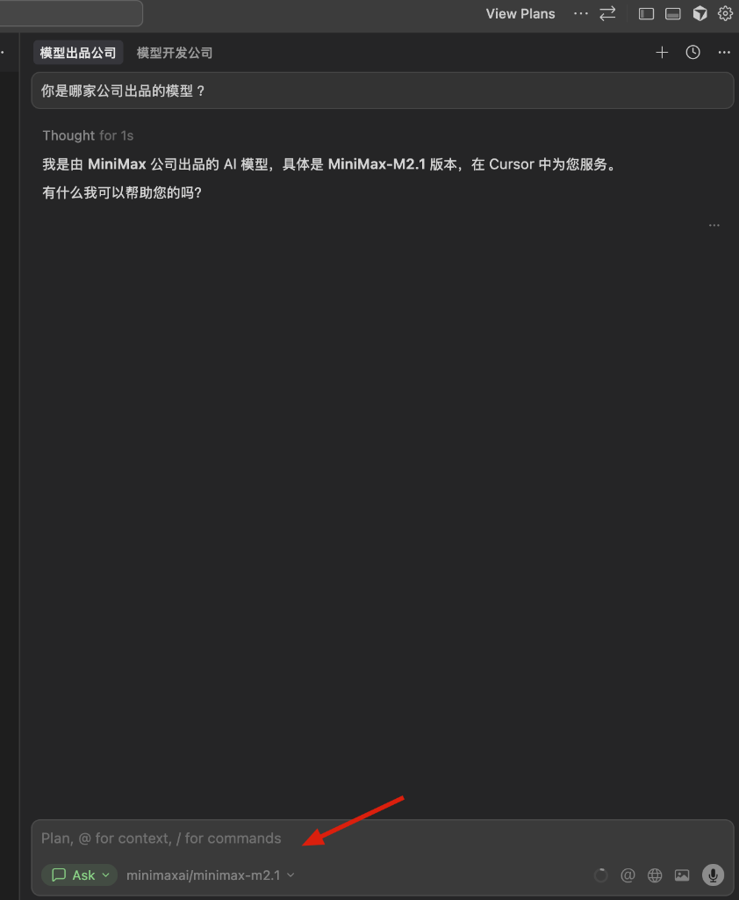

大家好，上一篇我们聊了 Manus 浏览器自动化，今天来聊点更“硬核”的福利——如何给你的 Cursor 加上免费的“弹药”。

Cursor 确实好用，但高强度的 AI 编程对 Token 的消耗也是实打实的。虽然官方有 Pro 订阅，但在开发一些实验性功能或者日常轻度使用时，能薅到免费且高质量的羊毛，何乐而不为呢？

最近，**英伟达 (NVIDIA)** 开放了一个非常良心的福利：通过 

NVIDIA NIM (NVIDIA Inference Microservices)

我们可以申请到免费的 API Key，直接调用包括 **GLM-4** 和 **MiniMax** 在内的多种高性能模型。

重点我都帮你划好了：
*   **免费额度**：Up to 40 rpm (Requests Per Minute)，对于个人日常编程来说绝对够用了。
*   **注册友好**：实测支持中国邮箱和中国手机号，注册过程非常丝滑。
*   **模型丰富**：支持 Llama 3、Mistral、以及我们熟悉的国产之光 GLM-4 和 MiniMax。

下面就是保姆级的申请和配置教程。

### 01. 注册 NVIDIA 账号并获取 Key

首先，访问英伟达的开发者网站：

[https://build.nvidia.com/](https://build.nvidia.com/)

点击右上角的注册/登录。整个注册流程对国内用户非常友好，直接使用你的常用邮箱，手机号验证环节也完全支持 `+86` 的号码。相比于某些需要海外手机号的服务，英伟达这次可谓诚意满满。

注册并登录成功后，你会进入 Dashboard。在这里你可以看到 API Key 的管理界面。

可以看到，绿色的 **"Up to 40 rpm"** 格外显眼。每分钟 40 次请求，用来写代码、查 Bug、生成注释，基本上是“无限续杯”的感觉。

点击 **"Get API Key"**，你会得到一串以 `nvapi-` 开头的密钥，**请务必保存好这串字符**，它是你通往免费算力的钥匙。

### 02. 在 Cursor 中配置 NVIDIA API

拿到 Key 之后，打开我们的编程神器 **Cursor**。

1.  点击右上角的齿轮图标，进入 **Cursor Settings**。
2.  在左侧菜单选择 **Models**。
3.  找到 **OpenAI API Key** 下方的 **Override OpenAI Base URL** 选项。

这里是关键的一步：**我们需要把英伟达的 API 地址填进去。**

**Base URL 填入：**

 `https://integrate.api.nvidia.com/v1`

然后，将你刚刚申请到的 `nvapi-xxxx` 密钥填入上方的 API Key 输入框中（或者专门的 API Key 栏位，视 Cursor 版本而定，通常兼容 OpenAI 格式）。

> [!IMPORTANT]
> **注意：** Cursor 的自定义 API 配置（Override OpenAI Base URL）目前属于 **Pro 会员** 功能。如果你是免费版用户，可能无法直接在 Cursor 中配置。
> 
> **不过别担心，如果你不是 Cursor 会员，也有替代方案：**
> 你可以转而在 VS Code 中使用 **Roo Code** 或 **Cline** 这两个强大的开源插件。它们同样支持自定义 API Base URL，可以完美接入英伟达的这些免费 API，实现类似的 AI 辅助编程效果。

### 03. 验证与模型选择

配置完成后，我们不仅可以使用通用的 Llama 模型，更重要的是，还可以直接调用国内表现优秀的 **GLM-4** 和 **MiniMax**。

在 Cursor 的模型列表中，添加并开启这两个模型：
*   `z-ai/glm4.7`
*   `minimaxai/minimax-m2.1`

如下：

### 04. 实战效果

配置完毕，让我们来试一试效果。

我试着问了 MiniMax 一个关于它自己版本的问题，可以看到响应速度非常快，回答也准确：

再试试智谱的 GLM-4，同样表现出色，无论是代码生成还是逻辑对话，都能胜任日常的辅助开发工作：

### 05. 总结

整个过程大概只需要 5 分钟，你就能为你的 Cursor 接入一个强大且免费的后端。

40 rpm 的速率限制对于个人开发者来说极其宽裕。如果你还在为 API 的费用发愁，或者想尝试更多元的模型组合，英伟达的这个羊毛绝对值得一薅。

---

**最后，做个小推广：**

如果你想关注更多 AI 前沿资讯、AI 编程实战技巧，或者类似这样的硬核福利，欢迎关注我的公众号。让我们一起在 AI 时代，用技术武装自己，用工具解放双手。

Keep Coding, Keep Evolving.
