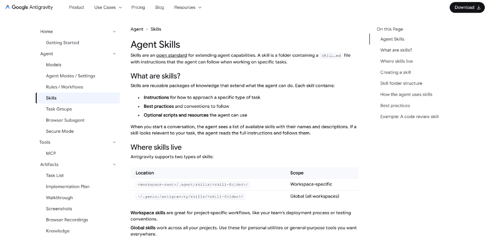
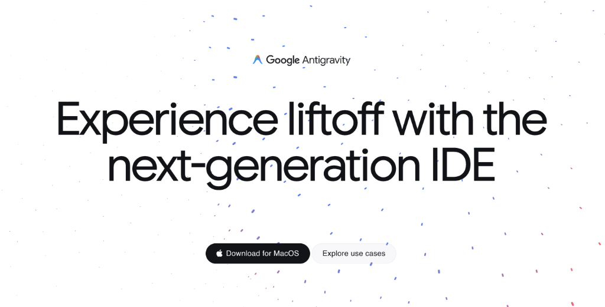
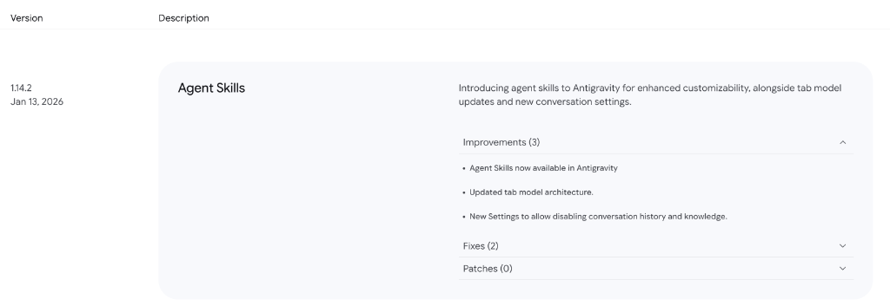

Antigravity 近期发布了 1.14.2 版本，其中最主要的变化是引入了 **Agent Skills**。

这就意味着，我们不仅可以通过对话和全局配置文件来控制 AI，还可以通过标准化的“技能包”来扩展 Agent 的能力。

### 01. 以前的模式

在此之前，我们在 IDE 中定制 AI 行为主要靠两种方式：
1.  **对话前输入 Prompt**：每次任务开始前，手动粘贴一段要求。
2.  **全局规则文件**：在项目根目录维护一个 `.cursorrules` 或类似的文件，写入所有的项目规范。

### 02. 存在的问题

随着使用深入，这两种模式都暴露出了一些局限性。

手动粘贴 Prompt 显然效率太低。而全局规则文件虽然方便，但容易导致**上下文污染**。如果把所有的代码规范、文档风格、测试要求都塞进一个文件里，Agent 在处理简单任务时也会背负过多的上下文，有时甚至会产生指令冲突。

比如，在写文档时，Agent 没必要知道数据库的命名规范；在修 Bug 时，也不需要关注文档的排版格式。

### 03. 新的思路

为了解决这个问题，Antigravity 采取了**模块化**的思路。

与其让 AI 每次都带着所有规则上路，不如把它拆分成一个个独立的“技能”。Agent 平时保持轻量运行，只有在识别到特定任务时，才去加载对应的指令集。

### 04. 解决方案：Agent Skills

**Agent Skills** 就是这一思路的实现。

在 1.14.2 版本中，我们可以建立一个标准的文件夹结构来定义技能。每个 Skill 包含一个核心的 `SKILL.md` 文件，用来描述这个技能是做什么的、什么时候用、以及具体怎么做。

它的工作流程是：
1.  **定义**：在 `.agent/skills/` 下创建文件夹和 `SKILL.md`。
2.  **识别**：Agent 会根据用户当前的意图，自动判断是否需要调用某个 Skill。
3.  **执行**：一旦激活，Agent 会读取该 Skill 的具体指令进行操作。

以这篇文章为例，我定义了一个 **Writing Skill**，规定了文章结构和格式要求。当我提出“写一篇更新介绍”的需求时，Agent 自动识别并按照该 Skill 的规范生成了内容，而不需要我再重复输入排版要求。

### 05. 适用场景

Skills 支持两个层级的配置：
*   **项目级 (Workspace)**：存放在 `.agent/skills/`。适用于该项目特有的发布流程、代码风格或测试规范。
*   **全局级 (Global)**：存放在用户目录下。适用于通用的工具，比如 SQL 转换、日志分析或语言润色等。

### 06. 更新日志 (Changelog 1.14.2)

除了 Agent Skills，本次更新还包含以下内容：

*   **Agent Skills**：正式上线，支持自定义扩展能力。
*   **Tab Model**：更新了用于代码补全的 Tab 模型架构，提升响应效果。
*   **新增设置**：允许用户禁用“对话历史”和“知识库”，在需要隔离上下文或保护隐私时可以使用。
*   **UI 修复**：解决了部分组件的透明度显示问题。
*   **体验优化**：修复了聊天窗口自动滚动过于敏感的问题。

---

总体来看，Agent Skills 是对 Prompt 管理方式的一次工程化改进，让我们可以更灵活、更有组织地复用 AI 的能力。
