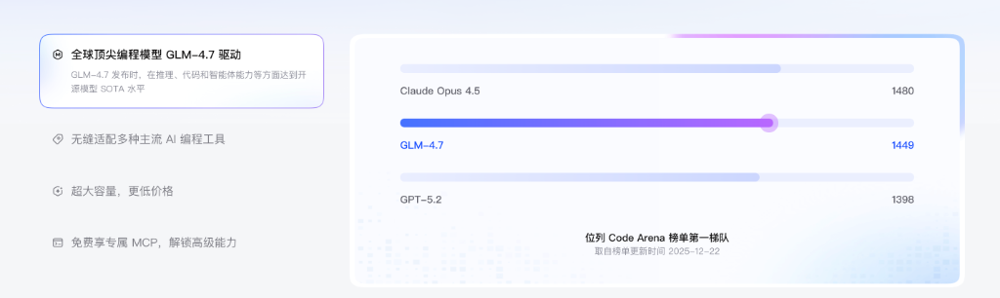
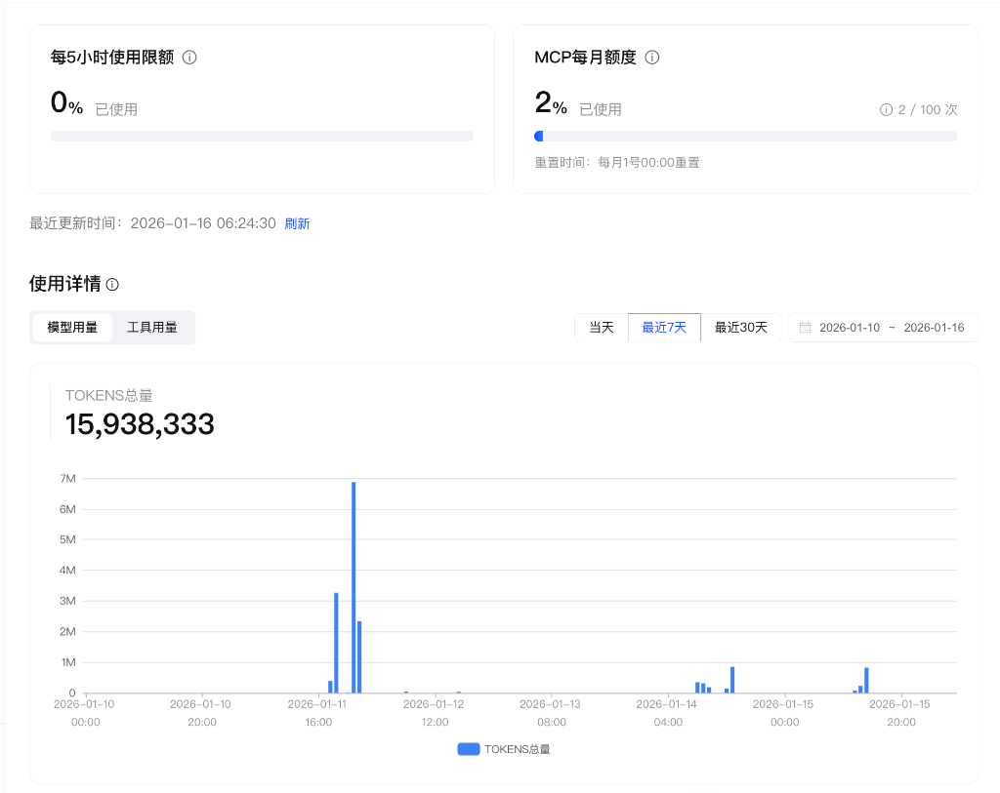
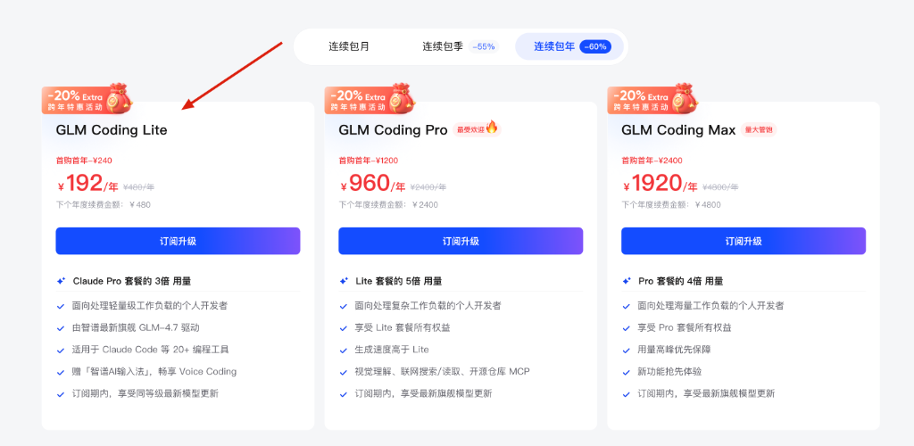

大家好，我是 Phoenix。

最近 AI 编程圈子最火的莫过于 Claude Code 了。它那强大的 Agent 能力确实让人爱不释手，仿佛真的有一个程序员坐在你旁边帮你写代码。

但对于国内的开发者来说，想要丝滑使用 Claude Code 其实面临着两座大山：

1.  **封号风险**：Claude 对于 IP 的风控众所周知，稍有不慎账号就没了，辛苦充值的余额也可能打水漂。
2.  **订阅成本**：每月 20 美元（约合人民币 145 元）的订阅费，对于很多学生党或者轻度使用者来说，长期下来也是一笔不小的开支。

那么，有没有一种既能保证开发体验，又能大幅降低成本，还不用担心封号的方案呢？

最近我深度体验了智谱推出的 **GLM Coding**，发现它完全可以作为 Claude Code 的完美平替，甚至在某些场景下性价比更高。

### 01. 硬实力的正面交锋

先说结论：在绝大多数核心编码能力上，GLM-4.7 已经非常接近 Claude Opus 了。

我们来看一组官方的 Benchmark 数据：



从图中可以看到，GLM-4.7 在 Code Arena 榜单上已经位列第一梯队，评分为 **1449**，而 Claude Opus 4.5 是 1480。也就是说，它已经达到了 Claude 旗舰模型 **95% 以上** 的能力。

对于日常的增删改查（CRUD）、Bug 修复、日志分析等工作，这 30 分的差距在体感上几乎是可以忽略不计的。但在价格和稳定性上，国产模型的优势就体现出来了。

### 02. 原生支持，无感切换

GLM Coding 最让我惊喜的一点，是它对于 **Claude 客户端 API 的原生支持**。

这意味着你不需要安装什么奇怪的插件，也不需要学习新的命令，它完全可以直接「借壳上市」，通过 Claude Code 的官方客户端来调用 GLM 的模型能力。

不仅如此，它还完美支持 MCP (Model Context Protocol) 和 Skill 系统。我在使用过程中，无论是代码补全的速度，还是对上下文的理解，都感觉非常流畅。

看看我最近的使用数据：



可以看到，在高强度的开发使用下，Token 的吞吐量非常稳定，响应速度极快。对于习惯了 Claude Code 交互体验的用户来说，迁移成本几乎为零。

### 03. 丰俭由人，Lite 足矣

说到大家最关心的价格，GLM 这次确实很有诚意。

它提供了 Lite、Pro、Max 三个档位。经过我这段时间的实际体验，对于大部分个人开发者来说，**Lite 套餐完全够用了**。



相比 Claude Pro 固定的 20 刀，GLM 的 Lite 套餐不仅价格更亲民，而且现在还有 **10% 的额外优惠**。

我自己目前在用的就是这个 **Lite 包季套餐**：


算了一下账，平均每个月下来的话，**差不多也就一杯咖啡的钱**。不仅非常划算，而且 Token 用量对于日常辅助编程来说完全充足。如果你想要在国内寻找一种 **稳定、快速、快捷** 的 Claude Code 使用方式，这绝对是我最推荐的方案。

这就引出了我今天要分享的「终极省钱与效率并存」的方案——**Alias 双持流**。

### 04. 进阶玩法：Alias 「双持」配置

虽然 GLM 已经很强了，但在涉及极其复杂的系统架构设计，或者需要「最高智慧」进行 Code Review 时，我也许还是会迷信 Google 或 Claude 的顶级模型（比如 Claude Opus）。

所以，我采取了一种折中的策略：**把脏活累活交给 GLM，把关键决策交给 Claude**。

通过在 Shell 配置文件（如 `.zshrc` 或 `.bashrc`）中配置 Alias，我们可以轻松实现这一点。

**配置方法：**

在你的配置文件中加入以下两行：

```bash
# GLM Coding (日常主力)
alias glmc="export ANTHROPIC_API_KEY='你的_GLM_Key'; export ANTHROPIC_BASE_URL='https://open.bigmodel.cn/api/paas/v4'; claude"

# Claude Code (关键时刻)
alias cc="export ANTHROPIC_API_KEY='你的_Claude_Key'; unset ANTHROPIC_BASE_URL; claude"
```

**我的使用场景是这样的：**

1.  **日常开发 (`glmc`)**：当你需要写脚本、分析日志、做简单的数据处理，或者在新项目中快速搭建脚手架时，直接终端敲 `glmc`。GLM 的速度快，更重要的是**额度充裕，不用心疼 Token**。
2.  **关键攻坚 (`cc`)**：当你遇到了极其晦涩的 Bug，或者需要对核心模块进行重构、需要 Opus 级别的逻辑推理能力时，敲 `cc` 切回官方源。

这样一来，你既保留了顶级模型的「杀手锏」，又用 GLM 极其低廉的成本覆盖了 90% 的日常工作。这就好比平时开电车代步（省钱），周末开跑车下赛道（性能），两全其美。

### 05. 专属福利

最后，如果你想体验这套「平替」方案，或者单纯想给自己的 AI 编程工具库增加一个强力候补，可以通过我的邀请链接注册订阅。

🔗 **订阅链接**：https://www.bigmodel.cn/glm-coding?ic=M7LX1XOZLO

通过此链接订阅，你将直接享受 **10% 的优惠减免**。

或者直接扫描下方二维码参与活动：


在这个 AI 编程工具爆发的时代，不一定非要「吊死」在一棵树上。灵活搭配，降本增效，才是我们程序员的生存智慧。
