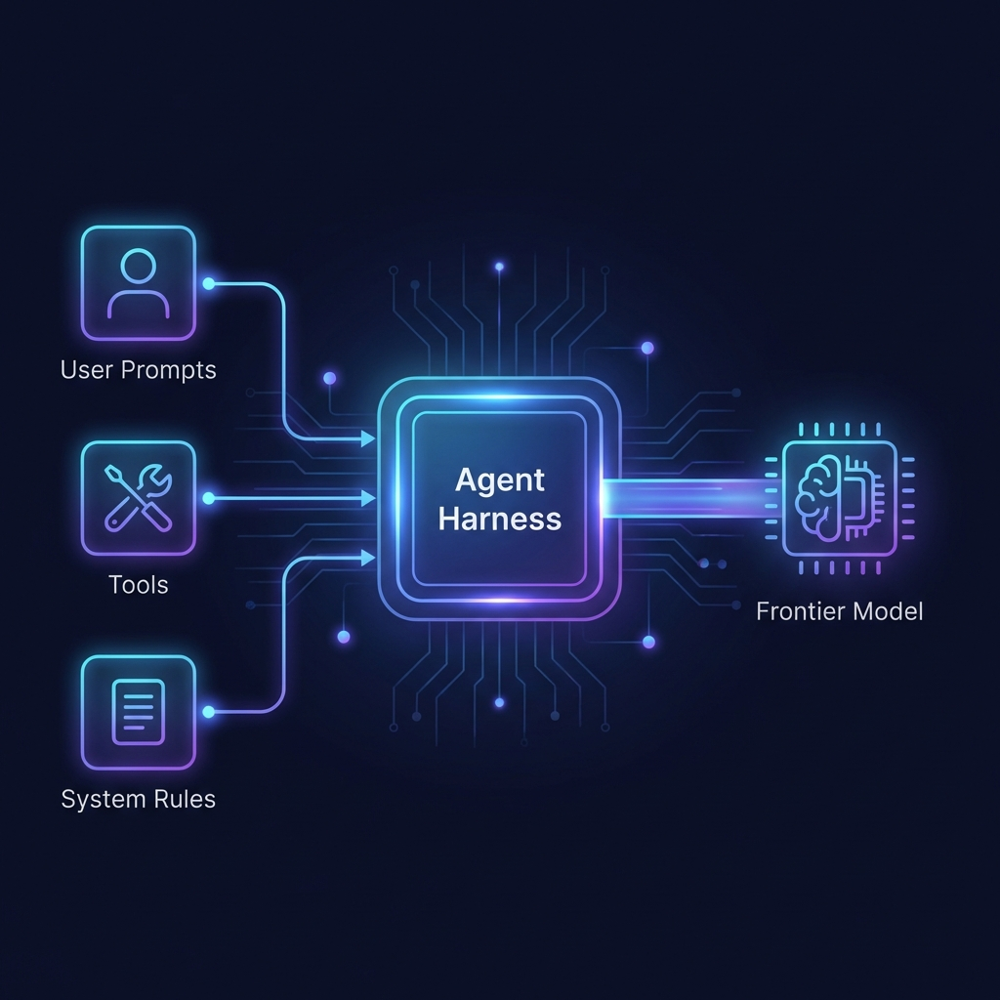
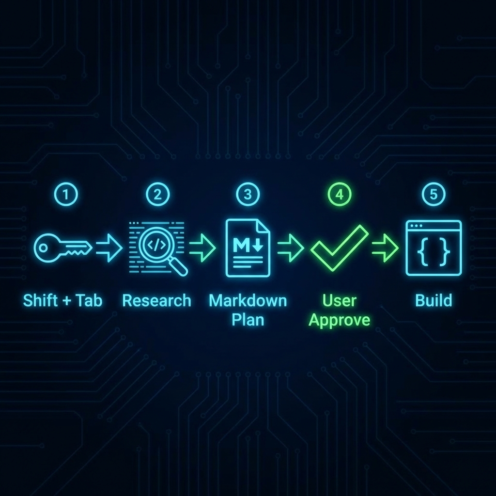
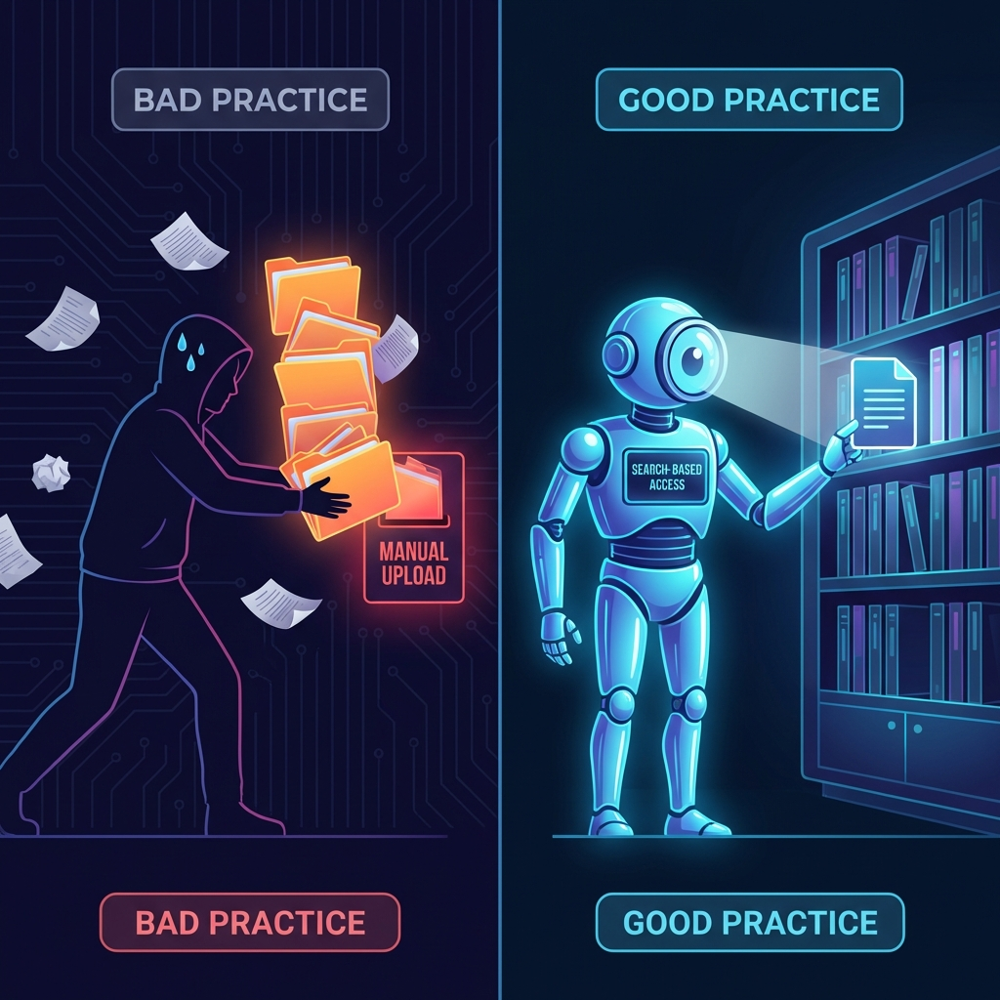

大家好，我是 Phoenix。

最近 AI 编程领域最大的变化，莫过于 Coding Agent（编程智能体）的崛起。现在的模型已经不仅仅是帮你补全几行代码，它们可以连续运行数小时，完成跨文件的重构，甚至自我修正直到单元测试通过。

但是，很多人（包括之前的我）在使用 Cursor 这类工具时，依然停留在简单的「聊天模式」：抛出一个问题，等待一段代码，复制粘贴，报错了再把错误贴回去。

这种方式其实并没有发挥 Agent 的真正潜力。

最近 Cursor 官方团队发布了一篇名为《Best practices for coding with agents》的深度指南。读完之后我大受震撼，原来我们一直都用错了。今天我就结合这篇文章，对其中的 **11 个核心主题** 进行一对一的深度提炼，帮大家把开发效率真正提上去。

### 01. 理解 Agent 的“大脑回路” (Understanding agent harnesses)

首先我们要理解，Cursor 的 Agent 并不只是一个简单的 LLM API 调用。它背后有一套精密的 **Agent Harness**（智能体挽具）。

这就像是给野马套上了缰绳。这个系统由三部分组成：
1.  **指令 (Instructions)**：系统级的 Prompt，规定了 Agent 的行为准则。
2.  **工具 (Tools)**：它能用的“手”，比如读取文件、搜索代码、运行终端命令。
3.  **用户消息 (User Messages)**：你发给它的需求。

为什么要有这套系统？因为不同的模型“性格”完全不同。一个擅长 Shell 命令的模型可能更喜欢用 `grep` 来搜代码，而另一个模型可能需要显式的指令才会去运行 Linter 检查错误。Cursor 帮你抹平了这些差异。

### 02. 谋定而后动 (Start with plans)

这是官方最具颠覆性的建议：**经验丰富的开发者更倾向于在编码前先做计划。**

在 Cursor 中，你可以通过按 `Shift + Tab` 切换到 **Plan Mode**（计划模式）。在这个模式下，Agent 不会急着写代码，而是会经历“调研 -> 提问 -> 生成 Markdown 计划 -> 等待批准”的严谨流程。

这避免了瞎写一通后的返工。记得把生成的计划保存到 `.cursor/plans/`，这将是你团队宝贵的文档资产。

### 03. 计划如果不准怎么办？ (Starting over from a plan)

如果 Agent 开发到一半跑偏了，**不要** 试图通过不断的追问去修正它。

**正确的做法是：** 回滚代码，回到 Plan 阶段，修改那个 Markdown 计划文件，让需求更明确，然后通过计划重新生成。这就好比盖楼歪了，不要强行矫正，而是重画图纸。

### 04. 像老手一样管理上下文 (Managing context)

别再疯狂地把所有文件都 `@` 给 AI 了。

*   **让 Agent 自己找 (Let the agent find context)**：现在的 Agent 拥有强大的检索能力（Instant Grep）。对于模糊的任务（如“检查认证流程”），让它自己搜，比你手动投喂更精准。
*   **何时开始新对话 (When to start a new conversation)**：当 Agent 开始迷糊、重复犯错，或者你完成了一个逻辑闭环时，果断开新对话。长上下文是噪音之源。
*   **善用引用 (Reference past work)**：新对话开始时，用 `@Past Chats` 引用之前的讨论，而不是复制粘贴文本。

### 05. 打造专属能力 (Extending the agent)

Cursor 提供了两种扩展方式，一静一动：

*   **Rules (静态)**：写在 `.cursor/rules/` 里的“家规”。比如规定“必须用 ES Modules”或“测试命令是 `npm run test`”。不用太细，只写它容易犯错的点。
*   **Skills (动态)**：定义在 SKILL.md 中的能力。它像是一个插件，只有在特定任务下才加载。

这也是实现 **Long-running agent loop** 的基础：你可以写一个脚本（Hook），让 Agent 不断循环“写代码 -> 跑测试 -> 修 Bug”，直到测试全部通过。

### 06. 有图有真相 (Including images)

不要只用文字描述 UI。

*   **Design to code**：直接把设计稿贴给它，让它还原布局和颜色。
*   **Visual debugging**：遇到样式 Bug，截图发给它，比你描述“左边偏了 5 像素”管用得多。

### 07. 常见工作流模式 (Common workflows)

官方总结了三种最顺手的 Agent 使用姿势：

1.  **TDD (测试驱动开发)**：先让 Agent 写测试，跑挂它，再让它写实现，直到绿灯。这是 Agent 开发的黄金法则。
2.  **Codebase understanding**：接手新项目时，把它当同事问：“这个项目的日志是在哪处理的？”“为什么要这么写？”
3.  **Git workflows**：用 `/pr` 让它帮你写 Commit Message、提 PR，甚至解决合并冲突。

### 08. 结对代码审查 (Reviewing code)

AI 写的代码，必须要审。

*   **生成时**：盯着 Diff 看，苗头不对按 `Esc` 打断。
*   **生成后**：使用 Agent Review 功能，让它自己审视一遍潜在的 Bug。
*   **架构图**：让它生成 Mermaid 架构图，从宏观层面检查设计是否合理。

### 09. 并行处理与多模态 (Running agents in parallel)

这是提升效率的大招：**并行工作**。

Cursor 支持原生的 **Git Worktree**，这意味着你可以同时开三个 Agent，一个修 Bug A，一个修 Bug B，一个搞重构，互不干扰。

甚至，你可以对同一个问题同时问 Claude 3.5 和 GPT-4o，看谁给出的方案更好（Multi-agent judging）。

### 10. 善用云端算力 (Delegating to cloud agents)

对于那些耗时久、不用一直盯着的任务（比如“给所有文件补充文档”），扔给 **Cloud Agents**。

它可以在云端后台默默干活，你只管去喝咖啡，等它干完了给你发个 Slack 通知，直接合并 PR 即可。

### 11. 终极调试：Debug Mode

当常规对话解决不了 Bug 时，开启 **Debug Mode**。

在这个模式下，Agent 会化身侦探：它不会通过瞎猜来修 Bug，而是会先插入日志（Instrumentation），收集运行时数据，根据实锤证据来定位根因。这专治各种“并发竞争”和“偶发故障”。

### 写在最后：养成好习惯 (Developing your workflow)

文章最后总结了高效开发者共有的特质：

*   **写具体的 Prompt**：不要说“加测试”，要说“参考 `__tests__` 目录的风格，为 `auth.ts` 的注销边缘情况写测试”。
*   **持续迭代配置**：Rules 不是一天写成的，发现 AI 总犯同一个错，就加一条 Rule。
*   **像对待协作者一样对待它**：要求它出计划，要求它解释，像带新人一样带它。

AI 不是来替代我们的，它是来帮我们从繁琐的语法和样板代码中解脱出来，去思考架构、业务和逻辑的。

Happy Coding!

---

[Best practices for coding with agents](https://cursor.com/blog/agent-best-practices)
