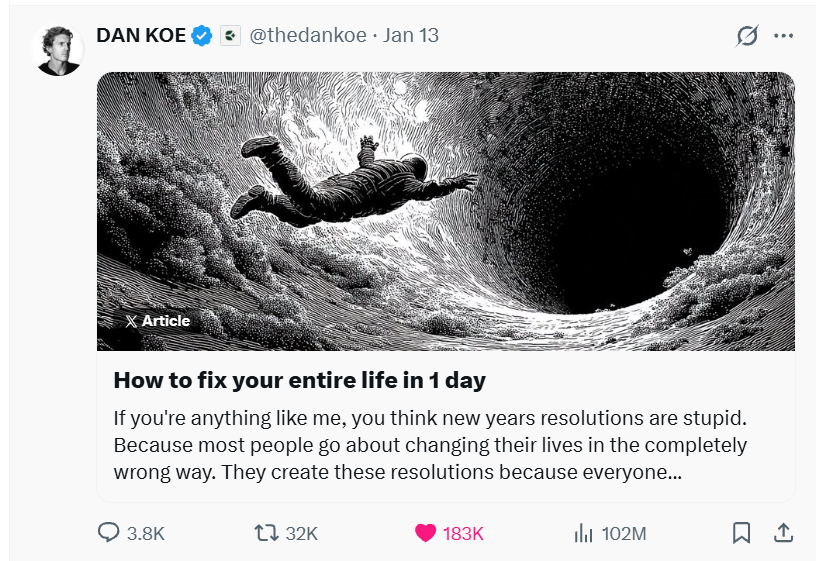
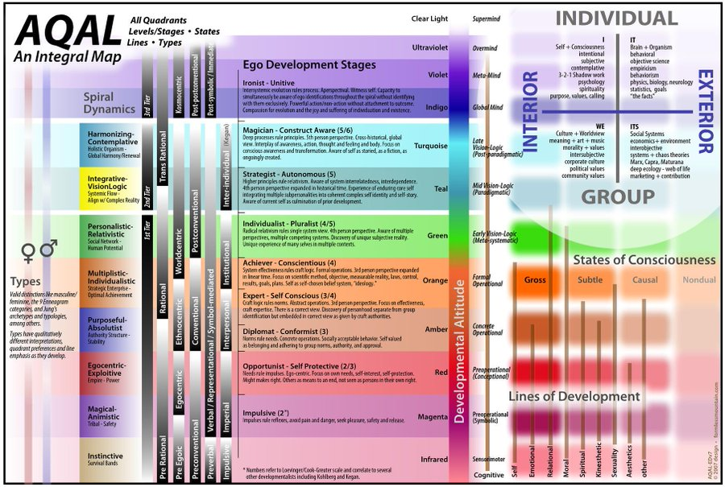
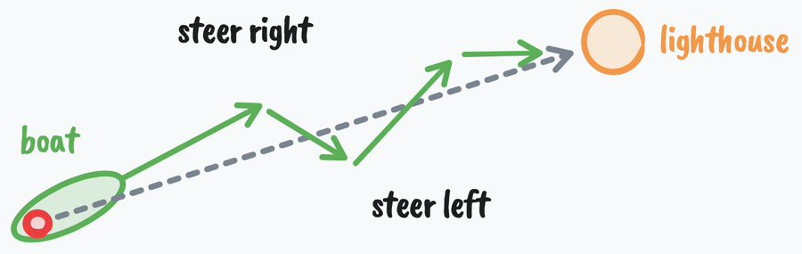

如果这里的你和我一样，大概也会觉得“新年计划”（New Year's Resolutions）挺蠢的。

大多数人改变生活的方式完全错了。他们制定计划只是因为别人都在做——这不过是一种肤浅的地位游戏。这种表面的决心，根本无法触及真正改变所需的核心，它需要的远比“今年我要更自律”这种自我催眠要深得多。

`Dan Koe` 在 X 上发布了一篇长文《If you're anything like me...》，极其硬核地拆解了**行为改变、心理学和生产力**的底层逻辑。读完之后我深受启发，这不仅仅是一篇鸡汤，更是一套完整的人生重构协议。

这篇文章目前在 X 上已经获得了**超过 1 亿次阅读 (102M Views)**，引发了现象级的讨论。这足以说明它击中了多少人的痛点——我们都想改变，却总是陷入死循环。

考虑到原文篇幅极长且是全英文，可能会劝退不少读者。为了不让你错过这篇年度佳作，我特意将这篇长文提炼成了**中文浓缩精华版**，方便你快速预览核心观点。如果你读完觉得意犹未尽，文章末尾我也附上了原文链接，欢迎去啃啃“生肉”。

为了确保内容的准确性和深度，我利用 AI 对这篇摘要进行了反复的 Review 和校对，力求原汁原味地还原 Dan Koe 的思想精髓。

今天，我就带你深度解析其中的 **7 个核心理念** 和 **1 套执行协议**，希望能帮你在 2026 年实现真正的蜕变。

### 01. 你没成功，是因为你“不是”那个人 (Identity over Actions)

设定大目标时，人们往往关注两点：
1.  **改变行动**：去以此达成目标（次要，二阶改变）。
2.  **改变身份**：让行为自然发生（核心，一阶改变）。

绝大多数人只盯着第一点。他们设立一个肤浅的目标，靠打鸡血坚持几周，然后因为根基不稳而崩塌。

**举个例子：**
你觉得健美运动员每天吃健康餐是在“坚持”吗？CEO 每天早起是在“强迫”自己吗？
在表面看是这样，但真相是：**他们无法想象除此之外的任何生活方式。** 对健美运动员来说，吃垃圾食品才需要“忍受”痛苦；对 CEO 来说，赖床才是真正的折磨。

如果你想达成某个结果，早在结果出现之前，你就必须**先过上**那种能导致该结果的生活方式。

### 02. 生活方式必须前置 (Lifestyle First)

这句听起来简单，但很多人就是不懂：

> **如果你想要某种人生结果，你必须在达成之前就拥有创造该结果的生活方式。**

如果你说“我想减掉 30 斤”，然后心想“等我瘦下来就可以恢复正常生活享受人生了”，那你注定会失败。因为你没有把导致你瘦下来的生活方式变成**永久的常态**。

当你真正改变自己时，那些阻碍你目标的旧习惯会让你感到**恶心**。你现在能容忍当下的标准，仅仅是因为你通过某种心理机制屏蔽了它带来的痛苦。

### 03. 一切行为都是目的导向的 (Teleology)

阿德勒心理学认为：**所有行为都有目的（Teleological）。**

这一开始听起来像废话，但细思极恐。
*   你抓鼻子是为了止痒。
*   你坐在沙发上刷手机，是为了消磨到下一个任务前的时间。

更深层的是：**你那些自我毁灭的行为，也是为了某种潜意识目标。**
比如你总是**拖延**，你可能告诉自己是“缺乏自律”。但实际上，你的潜意识目标可能是“保护自尊”——如果你不尽全力，失败了就没有人能说你能力不行。

**真正的改变需要改变你的目标。** 目标不仅仅是一个终点，它是你看向未来的**镜头**（Lens），决定了你能看到什么信息和资源。

### 04. 身份的解剖学 (The Anatomy of Identity)

为什么你成为了今天的你？这是一个通过反馈循环强化的过程：

1.  你有某种目标（Goal）。
2.  你通过这个目标的透镜感知现实（Perception）。
3.  你通过行动获得反馈。
4.  行为重复变成自动化习惯（Conditioning）。
5.  **行为固化为身份（"我是这种人..."）。**
6.  你为了心理一致性而通过各种方式**捍卫**这个身份。

大多数人的问题在于，他们在孩童时期为了生存（不仅是肉体生存，更是为了获得父母认可的概念性生存），全盘接受了外界的规训。

当你觉得自己是“某种不具备成功特质的人”时，每当有人挑战这个信念，你会像肉体受到攻击一样感到威胁，并本能地反击。必须打破这个循环。

此外，Dan 还提到了**心理发展阶段 (Ego Development Stages)**。如同上图所示，大多数人停留在“顺从者 (Conformist)”或“专家 (Expert)”阶段，被社会规则和他人评价所束缚。

要打破身份的枷锁，你需要意识到心智是可以进化的。从盲目顺从，到建立自我原则（Achiever），再到能够跳出系统看系统（Strategist），最终将身份视为一种可穿脱的“戏服”（Construct-Aware）。你的心智层级越高，你能玩的游戏就越高级。

### 05. 智力的本质是“方向盘” (Cybernetics)

Naval Ravikant 说：“智力的唯一真正测试是看你能否从生活中得到你想要的。”

Dan 提出了一个成功的公式：**成功 = 自主能动性 (Agency) + 机会 (Opportunity) + 智力 (Intelligence)**。
有了前两者，如果你缺乏智力，依然无法充分利用机会。而这里的“智力”，不仅仅是 IQ，而是 **Cybernetics（控制论）**。这个词源于希腊语，意为“擅长掌舵”。

一个高智商的系统包含四个步骤：
1.  **行动 (Act)**
2.  **感知 (Sense)**
3.  **比较 (Compare)**
4.  **修正 (Correct)**

就像恒温器感知温度并调节一样。低智商的表现是遇到障碍就停止，无法从错误中学习；高智商的表现是理解**任何问题在足够长的时间尺度下都是可解的**。

要变得更聪明，你需要：拒绝既定道路，潜入未知，设定更高的新目标来扩展心智，并学习自然的通用原则。

Dan 强调，要成为一个**深度通才 (Deep Generalist)**。不要只把自己局限在某个职业标签里（比如“我是个律师”、“我是个程序员”）。这种自我设限会让你变蠢。真正的高智力来自于跨学科的连接能力，来自于从混乱中建立秩序的能力。

### 06. 一天重启人生的协议 (The 1-Day Protocol)

Dan Koe 提供了一套需要**整整一天**来执行的协议，帮助你从当前的生活中解离（Dissonance），穿越迷茫（Uncertainty），找到方向（Discovery）。

**早晨：心理挖掘 (Vision & Anti-Vision)**
你需要花 15-30 分钟，诚实地回答一些**“令人尴尬”**的问题，挖掘出你潜意识里的不满：
*   **挖掘痛点**：“有哪些我长期抱怨但从未真正改变的事情？”“如果要向我最尊敬的人承认关于我生活的一个真相，那会是什么？”
*   **反愿景 (Anti-Vision)**：详细描述如果你未来 5 年、10 年都不改变，生活会变成什么样？那种平庸、那种痛苦、那种“你本来可以”的遗憾。利用这种**消极能量**作为燃料。
*   **愿景 (Vision)**：抛开现实性，3 年后你真正想要的生活是什么样的？你需要成为什么样的人（"我是..."）才能让这种生活变得自然？
*   **身份代价**：“为了改变，我必须放弃哪个旧身份？不再是那个身份，我在社交上会付出什么代价？”

**全天：打断自动导航 (Interrupting Autopilot)**
*   定几个闹钟（11:00, 13:30, 15:15...），在闹钟响时问自己扎心的问题：
    *   “我现在做这件事是在逃避什么？”
    *   “我是正在走向我不想要的生活，还是我想要的生活？”
    *   “今天我做的哪些事是出于‘身份保护’而非真实渴望？”（提示：不仅仅是一两件，而是绝大多数）
    *   “明天我能成为的、**最小版本**的理想自我是什么样子？”

**晚上：综合与决策 (Synthesizing Insight)**
*   找出一个阻止你前进的核心**内部敌人**（不是外部环境）。
*   写下一句你的**反愿景**（如果你不改变会发生什么）。
*   写下一句你的**愿景 MVP**（你要去向哪里）。

### 07. 把生活变成一场电子游戏 (Turn Life Into a Video Game)

> “内在体验的最佳状态是意识中存在秩序……当一个人必须把注意力集中在眼前的任务上，并暂时忘记其他一切时，追求目标就在觉知中带来了秩序。” —— 米哈里·契克森米哈伊 (Mihaly Csikszentmihalyi)

最后，也是最精彩的部分。当你拥有了以上所有组件，你可以把它们组装成一个**游戏系统**。这能让你进入心流状态，对生活产生如游戏般的痴迷。

拿出一张纸，写下这 6 个组件：

1.  **反愿景 (Anti-vision)**：输掉游戏的代价。如果不努力，你会掉入什么样的深渊。
2.  **愿景 (Vision)**：胜利条件。你想要达成的理想终局。
3.  **1 年目标 (1 Year Goal)**：主线任务。今年唯一的优先级。
4.  **1 个月项目 (1 Month Project)**：Boss 战。你需要习得什么技能？完成什么项目？
5.  **每日杠杆 (Daily Levers)**：日常任务 (Quests)。每天必须做的、能推动进度的 2-3 件事。
6.  **限制条件 (Constraints)**：游戏规则。为了赢，你绝对不能触碰的底线。

这就形成了一个同心圆式的力场，保护你的注意力不被外界干扰。

### 写在最后

真正的改变从来不是靠意志力去对抗旧的自己，而是通过深刻的觉察，构建一个新的**生活系统**，让正确的行为在其中自然发生。

别再制定无意义的新年计划了。去掌舵，去设计你的游戏，去成为那个能自然过上你想过生活的人。

---

原文链接：[Read the original thread by Dan Koe](https://x.com/thedankoe/status/2010751592346030461)
