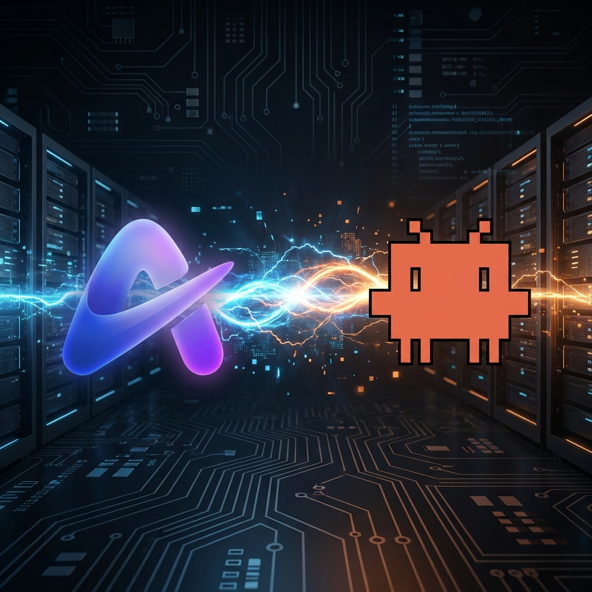
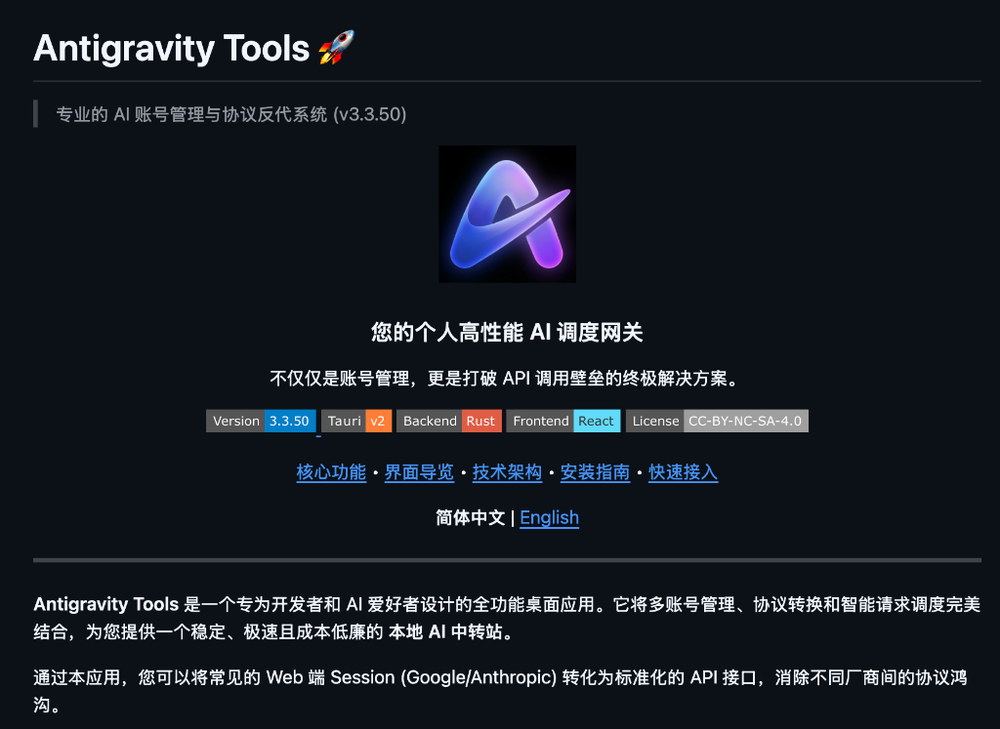
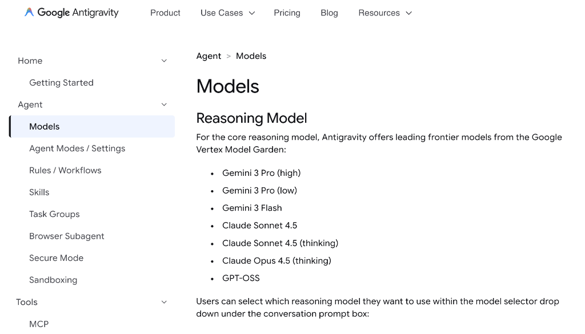
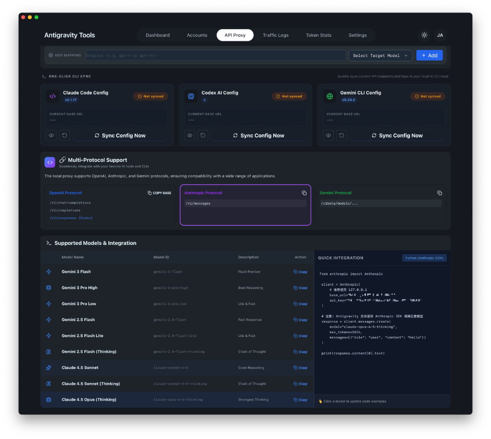
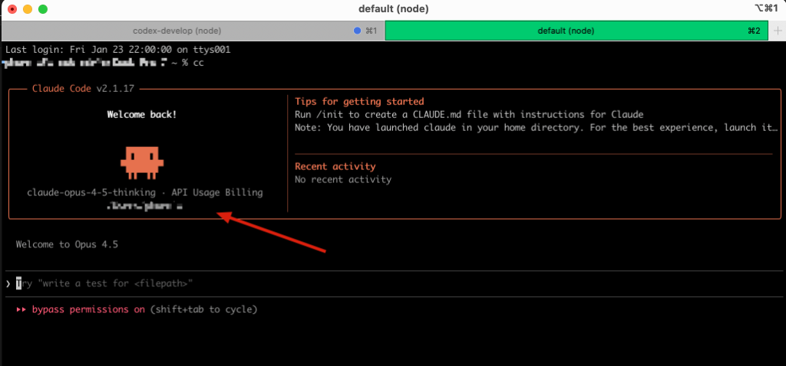

前段时间给大家推荐了 **GLM 4.7 + ClaudeCode** 的组合，这套方案确实能解决日常 80% 的编码需求。

但剩下的那 20% 怎么办？

遇到复杂架构设计、疑难 Bug 排查，或者是需要极高智商的重构任务时，你我都心知肚明：**还得是 Opus 4.5**。

但这里有两个非常现实的痛点：
1.  **封号太严重**：Claude 官方的风控简直是“宁可错杀一千，不可放过一个”，稍微多问几句，号就没了。
2.  **贵得离谱**：官方 API 或者 Pro 账号的成本，对于高频开发者来说，每个月都是一笔不小的开销。更别提 Pro 账号那点额度根本不够用的问题了。

### 01. 既要稳，又要省

最近我在探索。有没有一种方案，既能**不封号**（或者封了也不心疼），又能**低成本**地用上满血版的 Opus 4.5？

找了一圈，甚至试过各种不靠谱的转发，最后我把目光锁定在了 **ClaudeCode 的 API 模式 + Antigravity 反代** 这一组合上。

亲测了一个多月，我的结论是：**真香，且稳**。

虽然不能保证 100% 绝对安全（毕竟涉及到账号池），但相比直连官方的高风险，这个方案的**性价比和稳定性**简直是降维打击。

### 02. 实操方案：如何配置

下面是我的实操方案，建议收藏。

#### 第一步：准备“弹药”

首先，我们需要“原材料”。

去海鲜市场（某鱼）搜一下 **Antigravity 成品号**。目前的行情也就是几十块钱一个。

*   **注意**：这里强烈建议用**小号**。原因你应该懂的，自行权衡风险。买个成品号，最大的好处就是**便宜**且**即买即用**。

#### 第二步：神器登场 Antigravity Tools

有了账号，我们需要一个工具把它“洗”成标准的 API。

推荐这个在 GitHub 上已经拿了 17.2K Star 的神器：**Antigravity Tools**。它是专门用来做账号管理和协议反代的。

项目地址：[https://github.com/lbjlaq/Antigravity-Manager](https://github.com/lbjlaq/Antigravity-Manager)



下载安装好之后，界面长这样，非常极客。

#### 第三步：集成与 API Proxy

安装好之后的配置非常简单：

1.  在 Antigravity Tools 里，通过 **OAuth** 方式登录你刚买到的账号。
2.  进入 **Models** 页面，确保你能看到 **Claude Opus 4.5 (thinking)** 这个模型。



3.  回到 Dashboard，开启 **API Proxy** 功能。这时候工具会在本地启动一个服务（通常是 127.0.0.1:8045），把你的网页版 Session 转化成标准的 Anthropic API 接口。



#### 第四步：接入 ClaudeCode

最后一步，把这个“假装是官方 API”的接口，喂给 ClaudeCode。

因为我平时会在 GLM 和 Claude 之间反复横跳，所以我习惯在 `.zshrc` 里配置一个 **alias** (别名) 来快速切换。

这是我的配置，你可以直接抄作业：

```bash
# CC Claude alias (Antigravity Local Proxy)
# 使用 claude-opus-4-5-thinking 模型，开启 bypassPermissions，跳过登录提示
alias cc='unset ANTHROPIC_AUTH_TOKEN && \
      ANTHROPIC_API_KEY="sk-xxxxx" \
      ANTHROPIC_BASE_URL="http://127.0.0.1:8045" \
      ANTHROPIC_API_TIMEOUT="3000000" \
      ANTHROPIC_MODEL="claude-opus-4-5-thinking" \
      CLAUDE_CODE_DISABLE_NONESSENTIAL_TRAFFIC=1 \
      CLAUDE_CODE_SKIP_LOGIN=1 \
      claude --dangerously-skip-permissions'
```

**关键点解析**：
*   `ANTHROPIC_BASE_URL`: 指向 Antigravity Tools 的本地代理地址。
*   `ANTHROPIC_MODEL`: 指定我们要用的 Opus 4.5 thinking 模型。
*   `CLAUDE_CODE_SKIP_LOGIN=1`: 这个很重要，否则 ClaudeCode 每次都会跳出来让你登录。

配置完成后，在终端并在输入 `cc`，看到下面这个界面，就大功告成了：



### 03. 总结

这套方案的本质是：**用极低的成本购买成品号 -> 通过 Antigravity 转化为 API -> 接入 ClaudeCode 享受顶级模型能力。**

虽然有点“灰”，但在官方没有给出更好的解决方案之前，这不仅是**省钱**，更是为了**不中断心流**。

还没试过的，赶紧去折腾一下。**生产力工具，早用早享受。**
