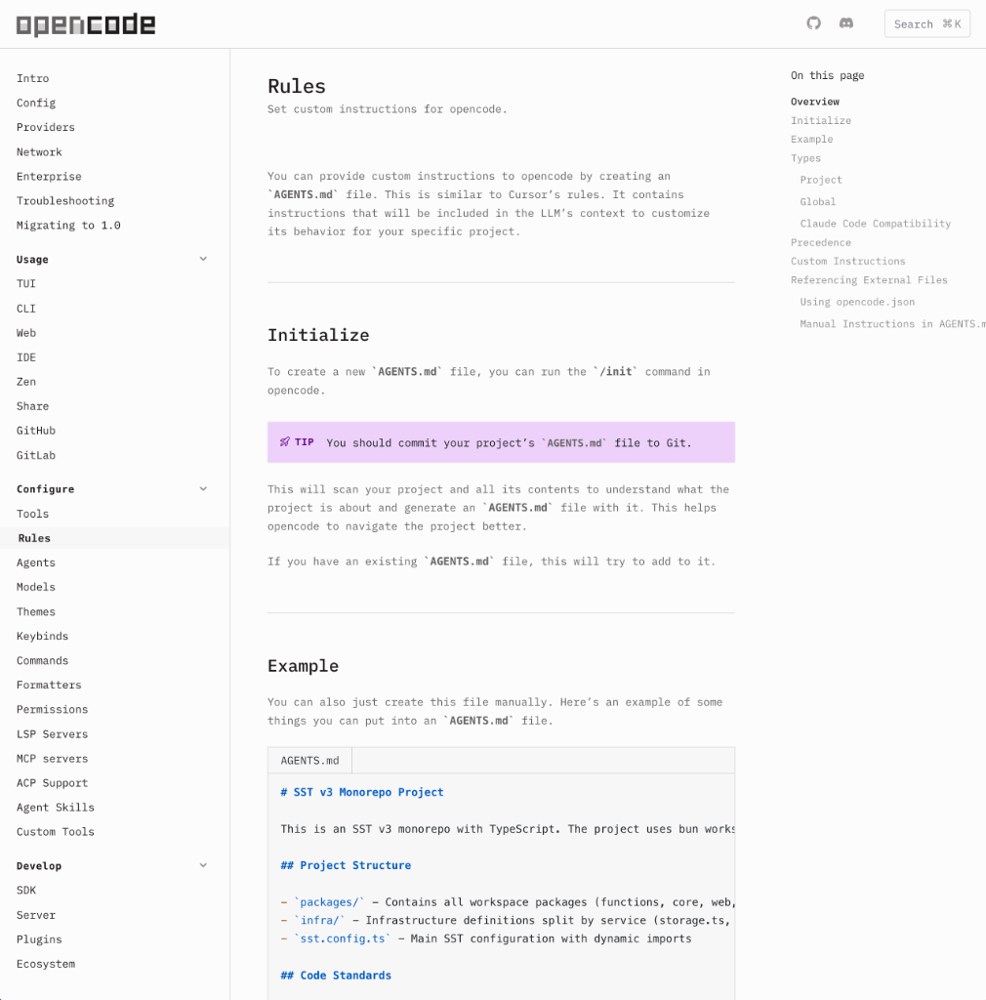
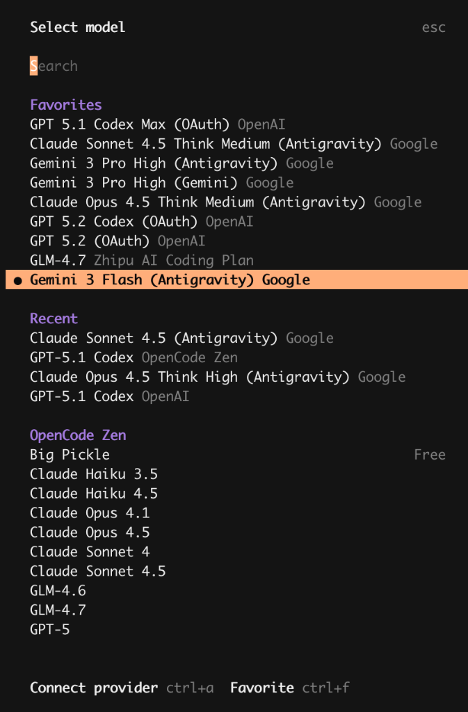

### 起因: 订阅的烦恼

作为一个**重度的 Agentic Software (AS) 用户**，我几乎把市面上所有顶级的 AI 编码助手都玩了个遍。

但我发现一个令人纠结的现状：**不同的模型，主打的核心能力完全不一样**。比如在处理极其复杂的代码逻辑重构时，我会更信任 GPT-5.2-codex 的细腻；而在需要处理超长文档或多个文件的全局上下文时，Gemini 3 Pro 的百万上下文能力是刚需；要是回到了国内的中文语境和特定的生态对接，智谱 GLM-4 则是不可替代的选择。

为了在不同场景下都能用上最强的那个“大脑”，我被迫成了**多修订阅用户**：同时维持着 Google AI、OpenAI 以及智谱 GLM 的会员。但这种“全都要”的代价是极其昂贵的——不是指那点订阅费，而是**心流的频繁切换**。为了用上最优模型，我得在各个厂商的网页界面、不同的终端甚至不同的配置环境之间反复横跳。

### 经过: 目录里的混乱

正是因为我想在不同场景下利用这些模型的最强能力，为了让每个助手都能“听话”，我被迫得按照各个厂商的脾气，给它们各自准备一份专属的“全家桶”配置。

这种**由于多重订阅带来的配置冗余**，让我的代码仓库目录瞬间变成了大型车祸现场。

如果你用过 Google AI Studio 或者相关的 Gemini CLI，你会发现它对目录结构有非常明确且强硬的定义。如果你想配置 Skill、MCP 或者自定义 Context，你必须严格遵守：
*   **Skill**: 必须放在 `.gemini/skills/` 目录下。
*   **MCP**: 连接配置必须写在 `.gemini/mcp.json` 中。
*   **Context**: 项目上下文规则必须叫 `.gemini/gemini.md`。

而到了 OpenAI 的官方客户端 (Codex / Open Code)，那又是另一套完全不同的“潜规则”，文件夹名字变成了 `.codex`，甚至连配置文件格式都变了：
*   **Skill**: 必须放在 `.codex/skills/` 下，且每个 Skill 必须是一个独立的文件夹。
*   **MCP**: 连接配置主要在 `~/.codex/config.toml` 中，还要配合 CLI 命令管理。
*   **Context**: 规则文件改名成了 `.codex/AGENTS.md`。

**最让我抓狂的是这种“一物多卖”的维护成本**。比如，我想给所有模型都加一个“写代码时遵循 PEP8 规范”的指令，我得在 `.gemini` 里写一遍，再到 `.codex` 里改一遍。如果我改动了一个 Skill 的逻辑，我得小心翼翼地在多个目录里同步更新。

这种感觉就像你虽然拥有很多把钥匙，但每把只能开一道特定的门。为了进不同的房间，你得在腰间挂上一大串沉甸甸的钥匙，还得时刻分辨哪把对哪把。

我一直在想：**有没有一种方式，能让我只写一次配置，就让所有的工具和模型都能直接调用？**

### 发现: Open Code 的统一方案

最近我发现了一个叫 **Open Code** 的工具，它简直就是为我们这种“模型全家桶”用户量身定制的。

这个工具最核心的魅力在于：它建立了一套透明的中间层。你只需要在 `.opencode` 这一个目录下完成所有配置，无论你切换到哪个订阅模型，它们都能共用这套“大脑”。

在 Open Code 的世界里，目录结构被高度统一了：
*   **Skill**: 统一放在 `.opencode/skills/<name>/SKILL.md`。
*   **Context (Rules)**: 统一写在 `.opencode/AGENTS.md`。
*   **MCP / LSP**: 所有的扩展服务和语言服务，统一在 `.opencode/config.json` 里通过一套 JSON 逻辑管理。

这意味着，我现在只需要在一个 terminal 终端里，通过**同一套文件配置**，就可以根据任务需求，在 OpenAI、Gemini、Claude 和 GLM 之间实现无缝丝滑切换。

比如，写极其复杂的业务逻辑时，我一键切到 Claude；需要对整个万行级别的工程进行扫描时，我秒切到 Gemini。

### 04. 意外之喜: LSP 语言规则服务

除了模型集成，Open Code 还有一个非常强大的功能：**支持 LSP (Language Server Protocol) 语言规则服务**。

之前我们用 AI 写代码，AI 往往是盲目地“盲猜”上下文。但 Open Code 通过接入 LSP，让 AI 拥有了像 IDE 一样的“眼睛”：
1.  **极大提升修改准确性**：因为它能感知语法错误和类型信息，修改代码时不再是“大概其”，而是精准打击。
2.  **大幅减少 Token 消耗**：有了 LSP 提供的精准符号信息，我们不需要把成千上万行的无关代码都喂给模型，AI 知道该去哪看，Token 账单自然就缩水了。
3.  **精准追踪调用链路**：在重构或者排查 Bug 时，AI 可以通过 LSP 准确地追踪代码的引用和定义，效率提升不止一个量级。

这绝对是一个非常硬核且实用的功能，直接把 AI 辅助编程从“玄学阶段”拉到了“工业级精度”。

### 结果: 枢纽重于工具

这种统一带来的不仅仅是便利。以前我拿着很多把钥匙去试不同的门，现在我手里是一张**万能房卡**。

因为配置统一了，我现在更专注去打磨那份 `.opencode/AGENTS.md` 里的 Working Agreements，去优化那几个通用的 Skill。我不再纠结“这个问题用哪个工具”，而是习惯于“在这个枢纽里，让最适合的模型去干最适合的事”。如果你也深陷多个 AI 订阅的配置泥潭，或者厌烦了不同客户端之间那套互不兼容的目录游戏，Open Code 或许就是那个能连接所有碎片化工具的最佳枢纽。

**站在 2026 年的新起点上，我后续的生产力实验都会在 Open Code 这个枢纽上进行。**无论是更深度的 **Agentic Workflow 自动化**，还是如何打磨出一套通用的 **AI 编程指令集**，我都会在真实的实战场景（包括那些不眠不休的 Bug 修复之夜）中持续探索。这些带血、带肉、带干货的 **AI 编程实战经验**，我会定期在这个公众号整理分享出来。

如果你也不想在工具的孤岛中孤军奋战，**欢迎持续关注**。我们下一篇实战干货见。
